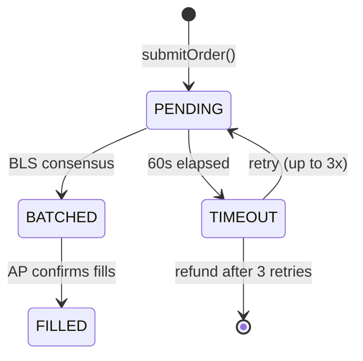

# Order Lifecycle

You click a button. Behind that click, three machines decide whether to trust each other. They agree in under a second. A real exchange executes a real trade. Tokens appear in your wallet. The entire journey takes less time than reading this paragraph. Here is what happens in that silence.

## Buy Flow

Ten steps between your USDC and your tokens. Each one can fail. None of them do, almost always.

<Steps>
  <Step title="USDC Approval">
    The wallet approves the contract to spend USDC. A one-time act of trust. Or per-transaction, if your wallet is more cautious than you are.
  </Step>
  <Step title="Submit Order">
    `submitOrder(itpId, amount, BUY)`. Your USDC moves to the contract and is **escrowed**. It is no longer yours. It is not yet theirs. It belongs to the protocol.
  </Step>
  <Step title="Order is PENDING">
    Your order enters `PENDING`. It sits on-chain, visible to the issuer nodes. It will stay there for about one second. In that second, three machines decide whether to trust each other. This is consensus.
  </Step>
  <Step title="COLLECT Phase">
    The issuer nodes detect pending orders during **COLLECT** (200ms). All orders are gathered into a candidate batch. The clock is already running.
  </Step>
  <Step title="PROPOSE Phase">
    The cycle's **leader** (round-robin election) proposes a batch. Order IDs, batch hash. A proposal is an opinion backed by cryptography.
  </Step>
  <Step title="BLS Signing">
    Peer nodes **validate** the batch — checking order data, prices, consistency. Each signs the batch hash with its BLS private key. Agreement is not given. It is earned.
  </Step>
  <Step title="Signature Aggregation">
    The leader collects signatures. Once `ceil(2n/3)` of registered issuers have signed, the signatures collapse into a single compact proof. Many voices, one signature.
  </Step>
  <Step title="Batch Confirmation">
    `confirmBatch()` is called on-chain with the aggregated BLS signature. The contract verifies it against the registered public key. Orders move to `BATCHED`. The consensus is now permanent.
  </Step>
  <Step title="Exchange Execution">
    The Authorized Participant (AP) sees `TradeRequest` events. It executes real trades on **Bitget**. Real order books. Real counterparties. The abstraction ends here.
  </Step>
  <Step title="Fill Confirmation">
    The AP calls `confirmFills()` on-chain. The contract checks each fill against the **0.1% price tolerance**. If it passes, ITP tokens are **minted** to your wallet. Status: `FILLED`. The journey is over. The exposure begins.
  </Step>
</Steps>

## Sell Flow

Selling is the buy flow in reverse. The same consensus, the same execution, the same precision. Only the direction changes, and with it, the emotion.

<Steps>
  <Step title="Submit Sell Order">
    `submitOrder(itpId, amount, SELL)`. Your ITP tokens are escrowed. You have decided to leave.
  </Step>
  <Step title="Consensus and Batching">
    The same COLLECT, PROPOSE, and BLS signing phases. The protocol does not distinguish between conviction and capitulation.
  </Step>
  <Step title="Exchange Execution">
    The AP sells the underlying assets on Bitget.
  </Step>
  <Step title="Settlement">
    `confirmFills()` is called. The contract **burns** your ITP tokens and **returns USDC** at the execution price. You are whole again. Or less than whole. The math will tell you.
  </Step>
</Steps>

## Cycle Timing

One second. Five phases. The issuer nodes run this cycle continuously, without pause, without weekends. The machines do not tire. That is their advantage over you.

```mermaid
gantt
    title 1-Second Consensus Cycle
    dateFormat X
    axisFormat %L ms
    section Phases
    COLLECT    :a, 0, 200
    PROPOSE    :b, 200, 400
    SIGN       :c, 400, 600
    CONFIRM    :d, 600, 800
    REBALANCE  :e, 800, 1000
```



| Phase | Duration | What Happens |
|-------|----------|--------------|
| **COLLECT** | 200ms | Issuer nodes scan for new pending orders on-chain |
| **PROPOSE** | 200ms | Leader proposes a batch of collected orders |
| **SIGN_SUBMIT** | 200ms | Peer issuer nodes validate and BLS-sign the batch; leader aggregates and submits |
| **CONFIRM** | 200ms | Batch confirmation transaction is processed on-chain |
| **REBALANCE** | 200ms | Any pending rebalance operations are executed |

<Info>
An order is batched within 1-2 seconds. Full settlement, including exchange execution, completes in under 10 seconds. Fast enough that you cannot change your mind. Which is, perhaps, the point.
</Info>

## Order States

Four states. An order is born, batched, filled, or abandoned. There is no fifth state. There is no ambiguity.



| State | Description |
|-------|-------------|
| `PENDING` | Order submitted and USDC/tokens escrowed. Waiting for next cycle. |
| `BATCHED` | Included in a confirmed batch with valid BLS signature. AP is executing. |
| `FILLED` | AP reported fills, tokens minted/burned, settlement complete. |
| `TIMEOUT` | Order was not filled within 60 seconds. Retried up to 3 times before escrowed funds are returned. |

## Safeguards

What stands between your money and catastrophe.

### BLS Consensus

Every batch requires a supermajority: `ceil(2n/3)` of registered issuers. Three nodes, at least two must sign. Twenty nodes, at least fourteen. The math is simple. The discipline is not.

<Warning>
BLS verification is **never bypassed**. Not in production. Not in testing. Not in local development. There is no test mode. There is no override. This is the one rule the protocol will not negotiate.
</Warning>

### Price Tolerance

The AP must execute within **0.1%** of the reference price. `confirmFills()` validates every fill on-chain. Report a price outside the band and the fill is rejected. The tolerance is narrow because trust should be narrow.

```text
|reference_price - fill_price| / reference_price <= 0.001
```

### Order Timeout

Sixty seconds. If the world has not responded by then, the order enters timeout.

1. First timeout: automatic retry. The protocol is patient.
2. Second timeout: another retry. The protocol is stubborn.
3. Third timeout: the order is cancelled. Your USDC or ITP tokens are returned. The protocol is not foolish.

<Note>
Timeouts are rare. They exist for the moments when exchanges go dark or networks congest. The safety net you never think about until the floor disappears.
</Note>

### Issuer-AP Separation

Issuer nodes and the Authorized Participant cannot speak to each other. The issuers read on-chain fill data and nothing more. This separation exists because the consensus layer and the execution layer must not collude. Systems fail when the watchers and the doers become friends.

## Netting

Buyers and sellers in the same cycle cancel each other out. $10,000 in buys, $7,000 in sells — only the net $3,000 goes to the exchange. The protocol matches what it can internally. Less trading, less cost, less exposure to the exchange. Elegance is the elimination of the unnecessary.
