# Docs Refactor — Implementation Plan

> **For Claude:** REQUIRED SUB-SKILL: Use superpowers:executing-plans to implement this plan task-by-task.

**Goal:** Fix 2 broken snippet references, add 11 Mermaid diagrams, and restructure 9 concept pages to practical-first pattern.

**Architecture:** Each task targets 1-3 related doc pages. Tasks are independent and can be parallelized. All changes are .mdx files only — no code changes. Each page gets: (1) practical quick-start section moved to top, (2) Mermaid diagram added, (3) deep technical detail moved to bottom, (4) cross-links to related concept pages.

**Tech Stack:** Mintlify MDX, Mermaid diagrams

---

### Task 1: Fix broken snippet references

**Files:**
- Create: `docs/snippets/chain-info.mdx`
- Create: `docs/snippets/nav-formula.mdx`

**Step 1: Create chain-info.mdx**

Create `docs/snippets/chain-info.mdx`:

```mdx
<Note>
**Network Configuration**

| Property | Value |
|----------|-------|
| Network | Arbitrum Orbit L3 |
| Chain ID | `111222333` |
| RPC | `http://142.132.164.24/` |
| Collateral | USDC (18 decimals on L3) |
| Block Explorer | Coming soon |

Add the network to your wallet: Settings → Networks → Add Network → enter the values above.
</Note>
```

**Step 2: Create nav-formula.mdx**

Create `docs/snippets/nav-formula.mdx`:

```mdx
<Note>
**NAV Formula**

```
NAV = sum(qty[i] * price[i]) / 1e18
```

Where `qty[i]` is the fixed per-share quantity of asset `i` and `price[i]` is its current market price. NAV is computed identically on-chain, in oracle nodes, and in the frontend. See [ITPs](/index/concepts/itps) for the full pricing model.
</Note>
```

**Step 3: Commit**

```bash
git add docs/snippets/chain-info.mdx docs/snippets/nav-formula.mdx
git commit -m "fix: create missing chain-info and nav-formula snippet files"
```

---

### Task 2: Vision concepts — batches, bitmaps, ticks

**Files:**
- Modify: `docs/vision/concepts/batches.mdx`
- Modify: `docs/vision/concepts/bitmaps.mdx`
- Modify: `docs/vision/concepts/ticks.mdx`

For each file, restructure to practical-first pattern. The new structure for each page:

#### batches.mdx — New structure

Keep the frontmatter. Replace the opening with:

**New opening (replace everything from line 6 to line 12):**

```mdx
## Quick Start: Join a Batch

Fetch active batches and join one with a USDC deposit:

```bash
# 1. List active batches
curl https://generalmarket.io/api/vision/batches

# 2. Join on-chain (Solidity)
vision.joinBatch(batchId, depositAmount, stakePerTick, bitmapHash)
```

See [Bot Quickstart](/vision/bots/quickstart) for a full working example.
```

**Add Mermaid diagram after the quick start (before "What Is a Batch?"):**

```mdx
## Batch Lifecycle

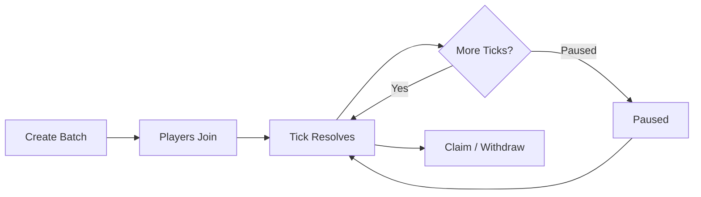
```

Then keep the rest of the page as-is but move "Batch Struct" and "Batch Metadata" sections to the end under a new `## Technical Details` heading.

#### bitmaps.mdx — New structure

**New opening (replace lines 6-7):**

```mdx
## Quick Start: Encode a Bitmap

Encode UP/DOWN predictions for 5 markets:

```python
from web3 import Web3
import math

def encode_bitmap(predictions: list[bool]) -> bytes:
    byte_count = math.ceil(len(predictions) / 8)
    bitmap = bytearray(byte_count)
    for i, is_up in enumerate(predictions):
        if is_up:
            bitmap[i // 8] |= 1 << (7 - (i % 8))
    return bytes(bitmap)

bitmap = encode_bitmap([True, False, True, True, False])  # UP, DOWN, UP, UP, DOWN
bitmap_hash = Web3.keccak(bitmap)
print(f"Bitmap: 0x{bitmap.hex()}, Hash: {bitmap_hash.hex()}")
```

See [Bitmap Encoding](/vision/bots/bitmap-encoding) for the full encoding guide.
```

**Add Mermaid diagram after quick start:**

```mdx
## Bitmap Flow

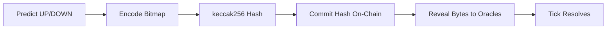
```

Keep existing "Bit Packing Specification" and everything below it, but move it under `## Technical Details`.

#### ticks.mdx — New structure

**New opening (replace lines 6-7):**

```mdx
## What Happens Every Tick

Every tick, the system resolves all markets in a batch:

1. Fetch start/end prices for each market
2. Determine outcome (UP / DOWN / FLAT)
3. Match winners against losers (parimutuel)
4. Update player balances
5. BLS-sign results across oracles

Check your balance after resolution: `GET /vision/balance/{batchId}/{playerAddress}`
```

**Replace the ASCII resolution cycle (lines 33-55) with Mermaid:**

```mdx
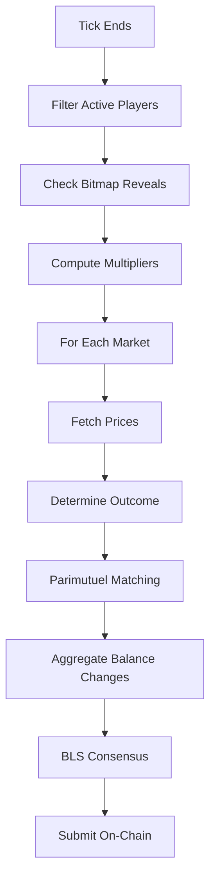
```

Keep the existing "Step by Step" section and everything below. No structural reorder needed — ticks.mdx already explains practical flow first.

**Step: Commit**

```bash
git add docs/vision/concepts/batches.mdx docs/vision/concepts/bitmaps.mdx docs/vision/concepts/ticks.mdx
git commit -m "docs: add diagrams and practical-first structure to Vision concept pages"
```

---

### Task 3: Vision concepts — balance-proofs, fees, resolution-types

**Files:**
- Modify: `docs/vision/concepts/balance-proofs.mdx`
- Modify: `docs/vision/concepts/fees.mdx`
- Modify: `docs/vision/concepts/resolution-types.mdx`

#### balance-proofs.mdx — New structure

**New opening (replace lines 6-7):**

```mdx
## Quick Start: Check Your Balance

```bash
curl https://generalmarket.io/api/vision/balance/{batchId}/{playerAddress}
```

Response: `{ "batch_id": 1, "player": "0x...", "balance": "15000000", "stake_per_tick": "100000" }`

To claim on-chain, you need BLS-signed proofs from 2/3+ oracles. See [Bot Lifecycle](/vision/bots/lifecycle) for the full claim flow.
```

**Add Mermaid diagram (replace or add after "BLS Signature Flow" heading):**

```mdx
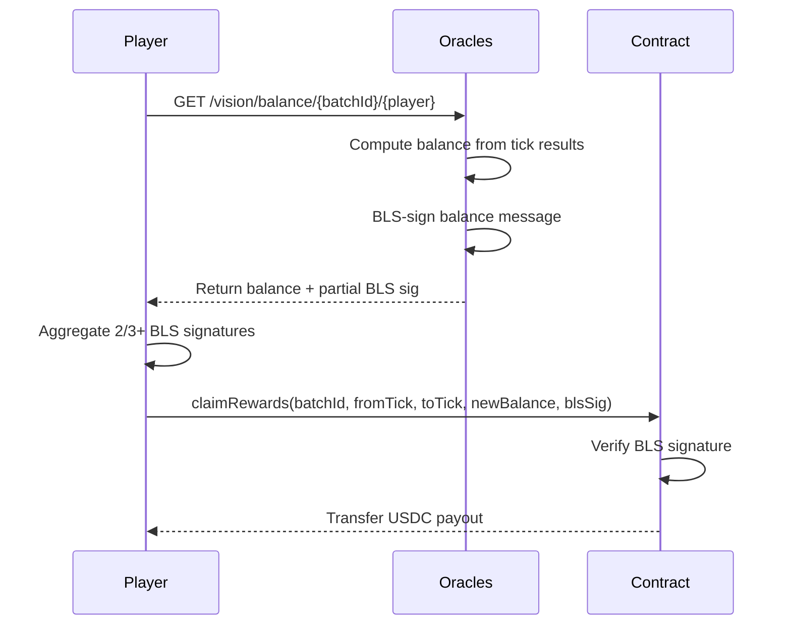
```

Keep all existing content below, but move "Why Off-Chain Balance Tracking?" after the diagram (it's explanatory, not practical).

#### fees.mdx — New structure

**New opening (replace line 6):**

```mdx
## Fee Summary

| What | Amount |
|------|--------|
| Fee rate | **0.05%** on profits only |
| Losers pay | **Nothing** |
| Min stake | 0.1 USDC per tick |

**Example:** You win 20 USDC → fee is 0.01 USDC → you receive 19.99 USDC.
```

**Add Mermaid diagram after the summary:**

```mdx
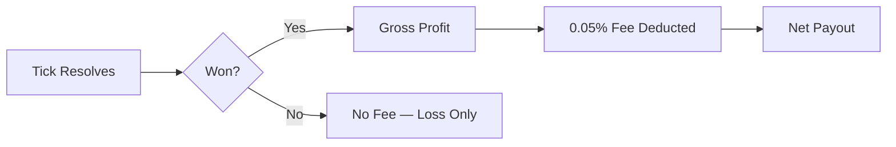
```

Keep all existing content below as-is (it's already well structured).

#### resolution-types.mdx — No structural change needed

This page already leads with the resolution type table (practical). Just add a Mermaid diagram showing the resolution decision flow:

**Add after the table (after line 20):**

```mdx
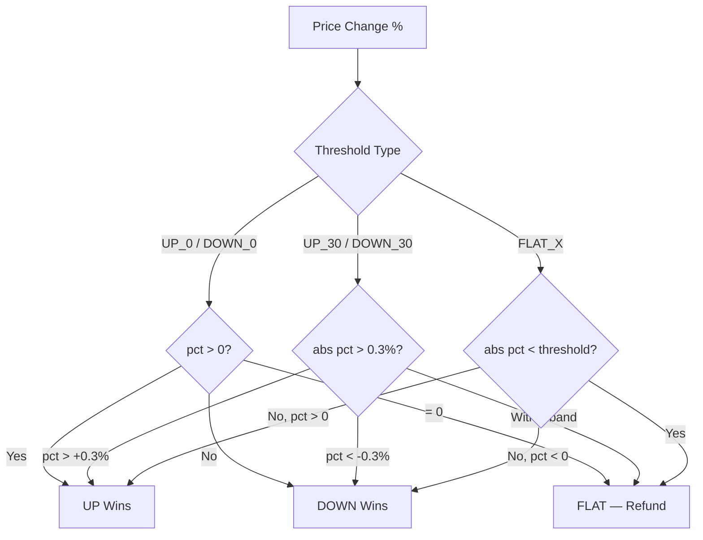
```

**Step: Commit**

```bash
git add docs/vision/concepts/balance-proofs.mdx docs/vision/concepts/fees.mdx docs/vision/concepts/resolution-types.mdx
git commit -m "docs: add diagrams and practical-first structure to Vision balance/fees/resolution pages"
```

---

### Task 4: Vision bots/overview — replace ASCII with Mermaid

**Files:**
- Modify: `docs/vision/bots/overview.mdx`

**Replace the ASCII architecture diagram (lines 12-41) with Mermaid:**

```mdx
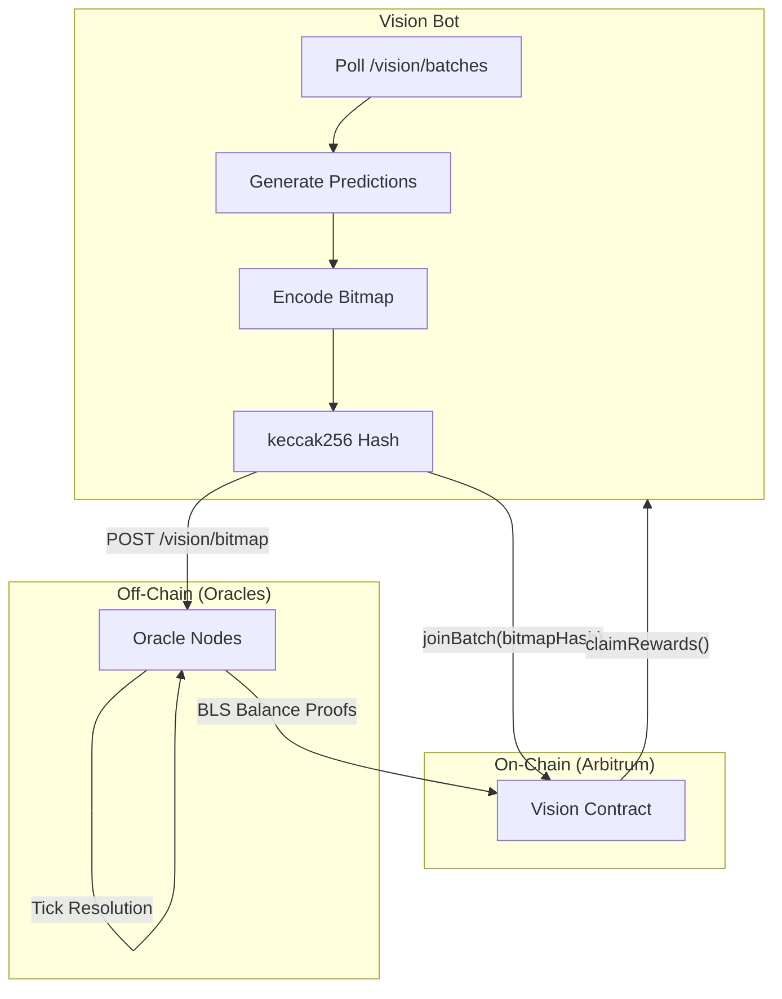
```

Keep everything else unchanged.

**Step: Commit**

```bash
git add docs/vision/bots/overview.mdx
git commit -m "docs: replace ASCII diagram with Mermaid in bot overview"
```

---

### Task 5: Index concepts — itps, order-lifecycle, lending

**Files:**
- Modify: `docs/index/concepts/itps.mdx`
- Modify: `docs/index/concepts/order-lifecycle.mdx`
- Modify: `docs/index/concepts/lending.mdx`

#### itps.mdx — New structure

**New opening (replace lines 6-8):**

```mdx
## Quick Start: Buy an ITP

```bash
# Check ITP price (NAV)
curl https://generalmarket.io/api/prices/{itpId}

# Buy on-chain
index.submitOrder(itpId, usdcAmount, OrderType.BUY)
```

See [Buy & Sell Guide](/index/guides/buy-sell) for the full step-by-step.
```

**Add Mermaid diagram after quick start:**

```mdx
## ITP Lifecycle

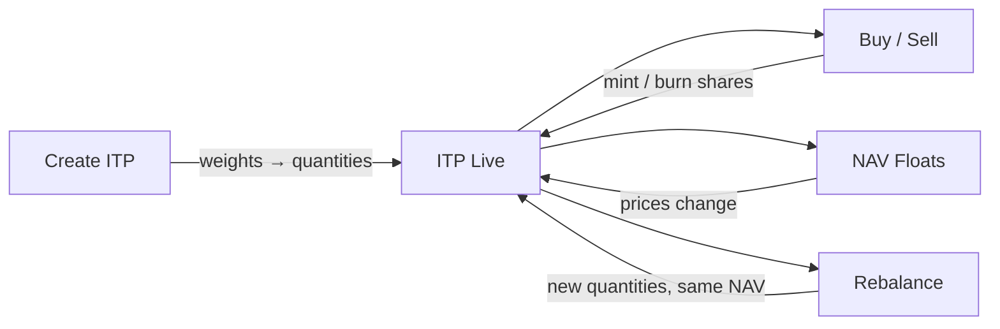
```

Keep "What Makes Up an ITP" and everything below. Move "Implementation Reference" table to end.

#### order-lifecycle.mdx — Add Mermaid state diagram

This page is already practical-first (Steps component). Just add a Mermaid state diagram after the "Order States" section (replace the ASCII on lines 91-95):

```mdx
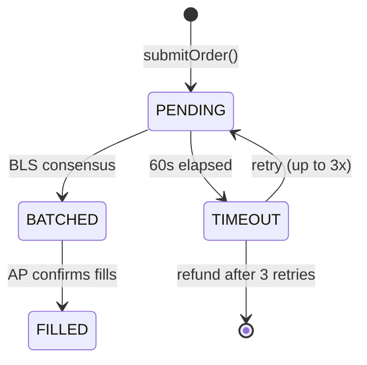
```

Also replace the cycle timing ASCII diagram (lines 70-73) with Mermaid:

```mdx
```mermaid
gantt
    title 1-Second Consensus Cycle
    dateFormat X
    axisFormat %L ms
    section Phases
    COLLECT    :a, 0, 200
    PROPOSE    :b, 200, 400
    SIGN       :c, 400, 600
    CONFIRM    :d, 600, 800
    REBALANCE  :e, 800, 1000
```
```

#### lending.mdx — New structure

**New opening (replace lines 6-8):**

```mdx
## Quick Start: Earn Yield on USDC

1. Go to the **Lending** section on [generalmarket.io](https://generalmarket.io)
2. Pick a lending market (each corresponds to an ITP)
3. Deposit USDC — you start earning interest immediately
4. Withdraw anytime — no lock-up

See [Lending Guide](/index/guides/lending) for the full walkthrough.
```

**Add Mermaid diagram after quick start:**

```mdx
## How It Works

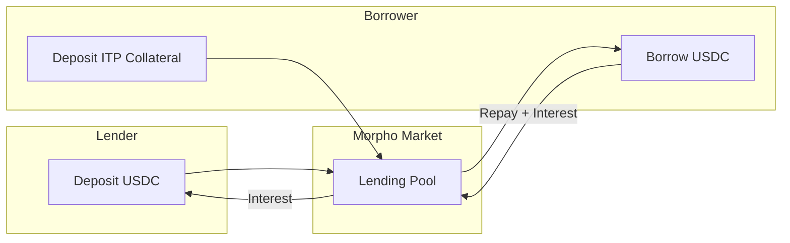
```

Keep all existing content below.

**Step: Commit**

```bash
git add docs/index/concepts/itps.mdx docs/index/concepts/order-lifecycle.mdx docs/index/concepts/lending.mdx
git commit -m "docs: add diagrams and practical-first structure to Index concept pages"
```

---

### Task 6: Index architecture — oracle-nodes, data-node

**Files:**
- Modify: `docs/index/architecture/oracle-nodes.mdx`
- Modify: `docs/index/architecture/data-node.mdx`

#### oracle-nodes.mdx — Replace ASCII consensus flow with Mermaid

Replace the ASCII diagram (lines 35-60) with:

```mdx
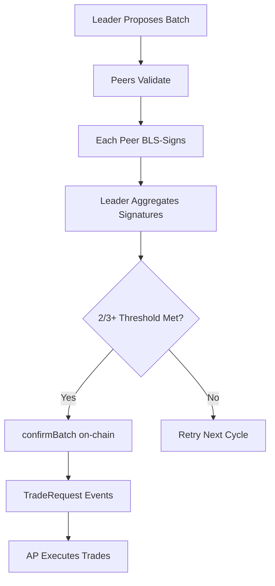
```

Also replace the cycle timing ASCII (lines 78-80) with:

```mdx
```mermaid
gantt
    title 1-Second Consensus Cycle
    dateFormat X
    axisFormat %L ms
    section Phases
    COLLECT    :a, 0, 200
    PROPOSE    :b, 200, 400
    SIGN_SUBMIT :c, 400, 600
    CONFIRM    :d, 600, 800
    REBALANCE  :e, 800, 1000
```
```

#### data-node.mdx — Replace ASCII pipeline with Mermaid

Replace the ASCII diagram (lines 67-80) with:

```mdx
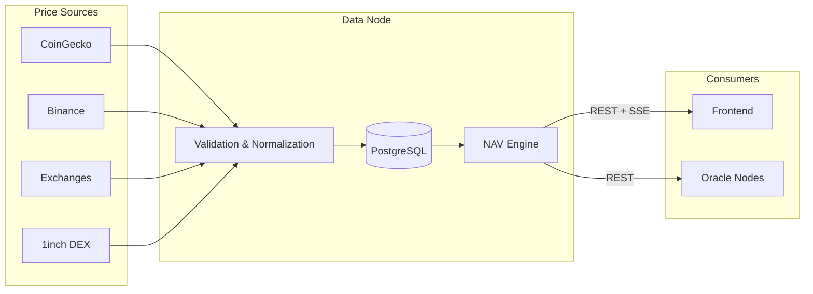
```

**Step: Commit**

```bash
git add docs/index/architecture/oracle-nodes.mdx docs/index/architecture/data-node.mdx
git commit -m "docs: replace ASCII diagrams with Mermaid in architecture pages"
```
