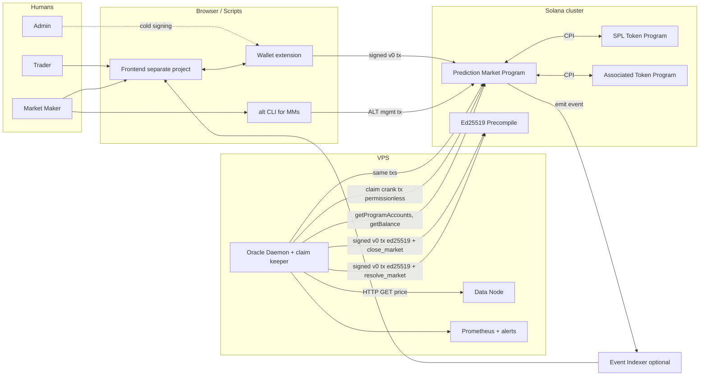
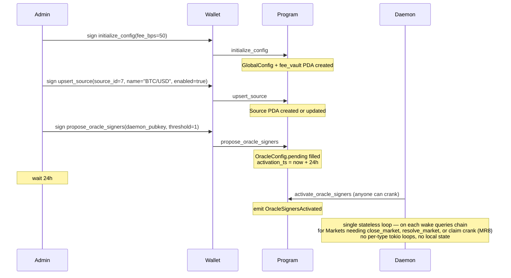
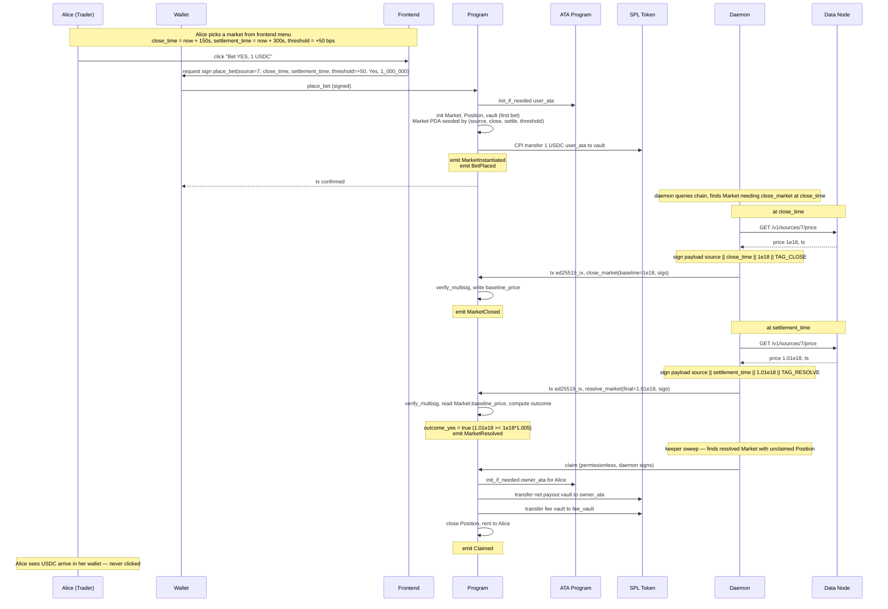
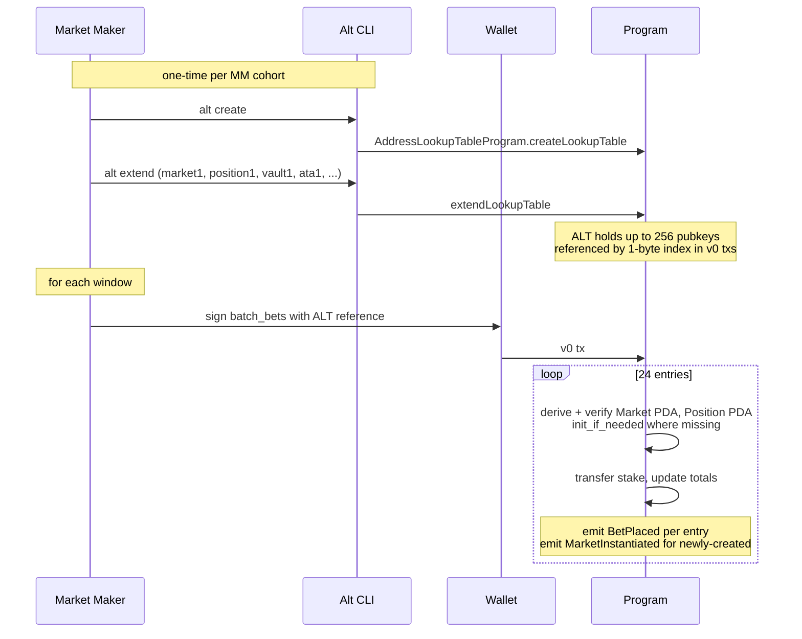
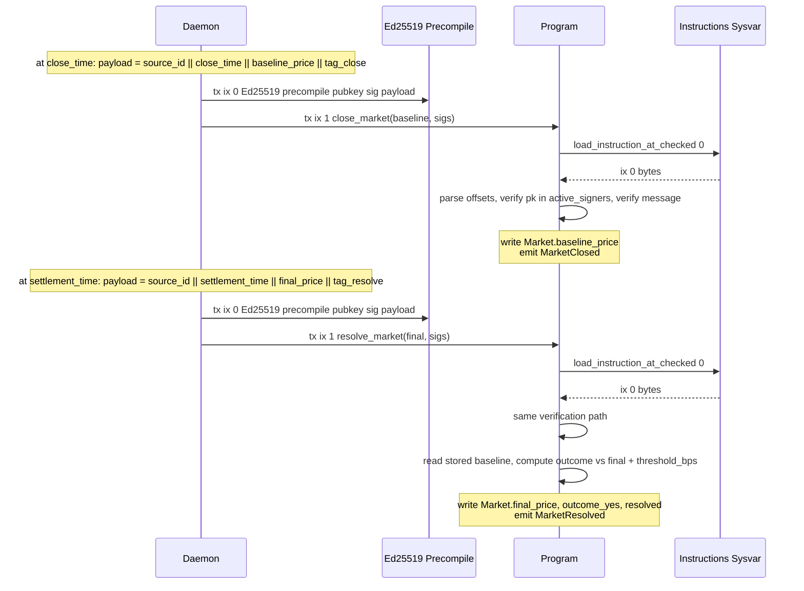
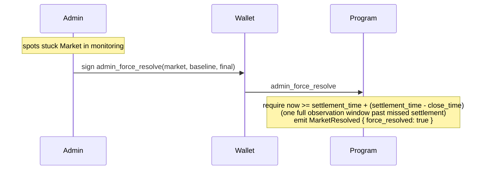
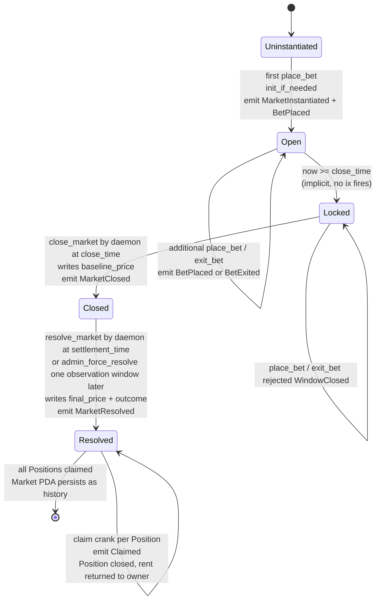
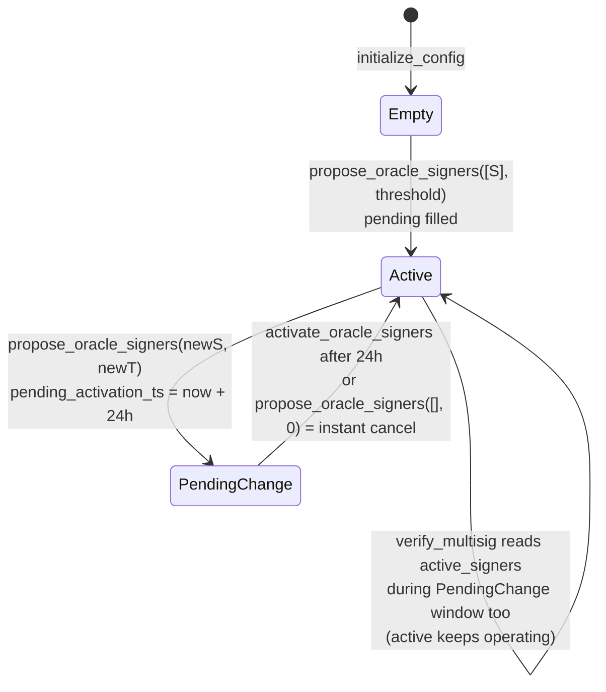
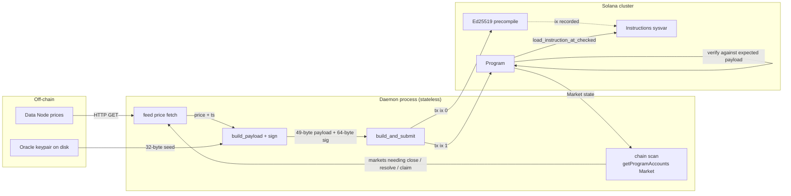

# Solana Prediction Market — Full Interaction Graph

Every actor, every instruction, every inter-party call, every state transition. The picture you look at before you ship, so you see what talks to what.

Companion to `2026-04-17-solana-prediction-market.md`. The plan builds it; this graph explains it.

---

## 1. Actors

| Actor | Kind | Runs where | Holds keys | Writes to chain |
|---|---|---|---|---|
| **Trader** | wallet user (retail) | browser | own wallet | place_bet, exit_bet (never claim — keeper cranks) |
| **Market Maker** | wallet user (advanced) | browser + scripts | own wallet | batch_bets, place_bet, exit_bet |
| **Admin** | governance key (day-one pubkey, later multisig) | hardware wallet | admin key | bootstrap, upsert_source, rotate oracle, pause, fee, force-resolve, withdraw |
| **Oracle Daemon / Keeper** | Rust binary | VPS under systemd | oracle keypair (= ed25519 signer) | close_market, resolve_market, claim (permissionless crank) |
| **Data Node** | existing Rust service (index project) | VPS | none | none (read-only HTTP) |
| **Solana Program** | Anchor Rust program | Solana cluster | none (program ID) | target of all txs |
| **Frontend** | Next.js app (separate project) | Vercel + user's browser | none (delegates to wallet) | none (builds txs the wallet signs) |
| **SPL Token Program** | system | Solana cluster | — | CPI target |
| **Ed25519 Precompile** | system | Solana cluster | — | CPI target (from daemon tx) |
| **Indexer** | optional (Helius / own) | off-chain | none | none |
| **Prometheus** | metrics scraper | ops infra | none | none |

---

## 2. System topology

What the diagram encodes: frontend never talks to the daemon. The daemon never talks to the frontend. Both talk to the program. The data node only talks to the daemon. The admin signs out-of-band; the wallet is the signing boundary.

---

## 3. Instruction surface — who calls what

Ordered by phase. Columns: who's allowed to sign, what accounts it writes, what CPIs it performs, what events it emits, guard errors.

| Instruction | Signer | Writes | Reads | CPIs | Events | Main error paths |
|---|---|---|---|---|---|---|
| `initialize_config` | admin | `GlobalConfig`, `fee_vault` | `stake_mint` | Token (init fee_vault) | — | FeeTooHigh |
| `upsert_source` | admin | `Source` | `GlobalConfig` | System (init if new) | — (silent per MR10) | Unauthorized |
| `propose_oracle_signers` | admin | `OracleConfig` (pending slots) | `GlobalConfig` | — | — | Unauthorized, PendingAlreadyQueued, ThresholdNotMet |
| `activate_oracle_signers` | anyone | `OracleConfig` (promote) | Clock | — | `OracleSignersActivated` | PendingNotReady, NoPending |
| `set_pause` | admin | `GlobalConfig.paused` | — | — | — | Unauthorized |
| `set_fee_bps` | admin | `GlobalConfig.fee_bps` | — | — | — | Unauthorized, FeeTooHigh |
| `propose_admin` | admin | `GlobalConfig.pending_admin` | — | — | — | Unauthorized |
| `accept_admin` | pending_admin | `GlobalConfig.admin` | — | — | — | Unauthorized, NoPending |
| `withdraw_fees` | admin | `fee_vault`, destination | — | Token (transfer, PDA-signed) | — | Unauthorized |
| `place_bet` | user | `Market` (init if first), `Position` (init if first), `vault` (init if first), `user_ata` (init if first) | `GlobalConfig`, `Source`, `stake_mint`, Clock | Token (transfer in), ATA (init) | `BetPlaced`, `MarketInstantiated` (first only) | Paused, SourceDisabled, BadThreshold, BadTime |
| `exit_bet` | user | `Market.totals`, `Position` | Clock | Token (transfer out, market-signed) | `BetExited` | WindowClosed, InsufficientBalance |
| `batch_bets` | user | N × `Market` (init if new) and `Position` | `GlobalConfig`, Clock | Token × N | N × `BetPlaced` (+ `MarketInstantiated` for newly created) | Paused, BatchTooLarge, Unauthorized, WindowClosed |
| `close_market` | anyone (daemon in practice) | `Market.baseline_price` | `OracleConfig`, Instructions sysvar, Clock | — | `MarketClosed` | AlreadyClosed, NotClosable, ThresholdNotMet, BadSignature |
| `resolve_market` | anyone (daemon in practice) | `Market` (final, outcome, resolved) | `OracleConfig`, `Market.baseline_price`, Instructions sysvar, Clock | — | `MarketResolved` | NotResolvable, AlreadyResolved, BaselineMissing, ThresholdNotMet, BadSignature |
| `admin_force_resolve` | admin | `Market` | `GlobalConfig`, Clock | — | `MarketResolved { force_resolved: true }` | Unauthorized, AlreadyResolved, ForceResolveTooEarly |
| `claim` | **cranker (permissionless)** | `Market`, `Position` (closed), `vault`, `fee_vault`, `owner_ata` (init if needed) | `GlobalConfig`, `Source`, Clock | Token × up to 2 (payout to owner, fee to fee_vault, market-signed), ATA (init) | `Claimed` | Unresolved, AlreadyClaimed |

**Note on `claim`**: after the Round 4–7 simplifications, `claim` uniformly closes the Position regardless of branch. Three internal paths:
- Winner (stake > 0, on winning side): compute parimutuel payout, transfer net to user + fee to fee_vault (or zero fee if one-sided pool), close Position to owner.
- Stranded (winning_total == 0, impossible to win): refund `yes_amount + no_amount` to owner, close Position.
- Loser (stake > 0 but on losing side): zero transfer, close Position, rent returned to owner.

---

## 4. Lifecycle — admin bootstrap

---

## 5. Lifecycle — trader: first bet through claim

---

## 6. Lifecycle — market maker batch

---

## 7. Lifecycle — oracle resolution (sig verification detail)

Two oracle txs per market — one at `close_time` pushing baseline, one at `settlement_time` pushing final. Both gated by ed25519 multisig.

Critical: the ed25519 precompile has already cryptographically verified the signature. The program only verifies the precompile was called with the right arguments — pubkey is a known oracle, message is the expected payload. Baseline is captured and committed on-chain at `close_time`; `resolve_market` reads it from Market state and only carries the final price.

---

## 8. Lifecycle — admin escape hatch (proportional delay)

Admin monitors markets via their own channels — block explorers, custom dashboards, the daemon's own logs. When a stuck market is spotted, force-resolve is called directly. No ops CLI ships.

Claim path identical after force-resolve — the permissionless keeper cranks it the same way, payout still flows to the Position owner. Traders never notice whether the daemon or the admin wrote the outcome.

---

## 9. State machine — `Market` PDA

Three notable properties: (1) there is no `Uninstantiated -> Locked` path — a window with zero bets is never a Market. (2) The `Locked -> Closed` transition is the first oracle touch; `Closed -> Resolved` is the second. (3) Claim is cranked by a keeper, not by the trader.

---

## 10. State machine — `OracleConfig`

Key property: during a pending change window, the oracle keeps resolving markets. There is no 24h freeze — active stays authoritative until explicitly promoted.

---

## 11. Data flows — every byte path

Three distinct byte surfaces: HTTP (daemon to data-node), ed25519 bytes (signed payload, TAG_CLOSE or TAG_RESOLVE), Solana tx bytes. No local persistence beyond the oracle keypair file — the chain is the source of truth for what needs doing.

---

## 12. Per-actor surface — what each party calls and never calls

### Trader (retail wallet)

**Calls:** `place_bet`, `exit_bet`.
**Never calls:** `claim` (permissionless, the keeper does it). Not `activate_oracle_signers`, not `resolve_market`, not `close_market`, not any admin ix.
**Reads (via RPC):** `Source` PDAs (whitelist), `Market` PDAs (pool state + resolution), own `Position` PDAs (stake + claim status).
**Watches (via events):** `BetPlaced` (own), `MarketResolved` (markets held), `Claimed` (own — arrives automatically via keeper crank).

### Market Maker

**Calls:** `place_bet`, `exit_bet`, `batch_bets`. Runs the `alt` CLI out-of-band to manage their Address Lookup Table.
**Never calls:** `claim` (keeper cranks), admin ixs, oracle ixs.

### Admin

**Calls:** `initialize_config` (once), `upsert_source` (per source), `propose_oracle_signers` + `activate_oracle_signers` (rotation), `set_pause`, `set_fee_bps`, `propose_admin` + `accept_admin` (handoff), `withdraw_fees` (revenue), `admin_force_resolve` (escape hatch).
**Never calls:** `place_bet`, `exit_bet`, `claim`, `close_market`, `resolve_market`. Admin is not a trader and not the oracle.

### Oracle Daemon

**Calls:** `close_market` and `resolve_market`. Also cranks `claim` on resolved markets (can be a separate bot; same pubkey either way).
**Never calls:** `place_bet`, `exit_bet`, `batch_bets`, anything admin.
**Reads (via RPC):** `Market` PDAs on every wake (stateless discovery), own signer balance (`getBalance`).
**HTTP clients:** data-node `/v1/sources/{id}/price`.
**Writes locally:** nothing. Oracle keypair file on disk is the only persistent artifact.

### Data Node

**Serves:** HTTP `GET /v1/sources/{id}/price` returning `{price: u128, ts: i64}`.
**Knows nothing about:** Solana, markets, signatures, the oracle daemon. It's an upstream feed.

### Frontend

**Builds txs for:** `place_bet`, `exit_bet`, `batch_bets` (MM mode). All signed by the user's wallet, submitted via Solana RPC. Frontend ships with a hardcoded catalog of `(source, threshold, close_offset, settle_offset)` combinations; resolves them to concrete timestamps at click time.
**Reads (via RPC):** `Source` PDAs, `Market` PDAs, `Position` PDAs.
**Consumes events:** via an indexer (Helius / custom). Never talks to the daemon directly.
**Never:** builds txs for `claim` (keeper does), signs oracle payloads, calls any admin ix.

### Indexer (optional)

**Subscribes to:** program events. Reindexes `BetPlaced`, `BetExited`, `MarketInstantiated`, `MarketClosed`, `MarketResolved`, `Claimed`, `OracleSignersActivated`.
**Serves:** historical queries for the frontend — "all markets for source X", "user's claim history", etc.

---

## 13. Failure matrix — what dies when what breaks

| Failure | Impact | Recovery |
|---|---|---|
| Data-node down | Daemon can't fetch price for `close_market` or `resolve_market` | Markets whose `close_time` or `settlement_time` fall during outage miss their oracle tx. Admin force-resolve unlocks `settlement_time + (settlement_time - close_time)` past settlement. |
| Daemon crashes mid-window | Stateless daemon — on restart queries chain, retries pending `close_market` / `resolve_market` / `claim` actions. No local state to lose. | Systemd restart, daemon resumes. If crash persists past force-resolve threshold, admin steps in. |
| Daemon keypair drained of SOL | Txs fail silently to land | Prometheus gauge alerts; boot refuses < 0.1 SOL (SA14). Refill from treasury. |
| Ed25519 SDK layout drift | Signature verification breaks | CI test (SR5) hashes upstream layout — build fails before deploy. |
| RPC cluster partial outage | Daemon retries with backoff | If partition exceeds one observation window, admin force-resolve. |
| Admin key lost | Protocol frozen for upgrades; resolutions continue via daemon; claims continue via keeper | Inevitable. `propose_admin` + `accept_admin` only help if BOTH old and new keys are usable. Document disaster scenarios. |
| Oracle key compromised | Attacker can `close_market` / `resolve_market` with arbitrary prices | Admin calls `propose_oracle_signers` with new set; 24h later `activate`. Compromised period loses markets resolved during it. Consider shorter rotation for this path. |
| Frontend down | Users can't open new bets via browser | MMs still have scripts. Direct-RPC access via CLI survives. Claims continue regardless (keeper). Frontend is non-critical infra. |
| Fee vault overfills | None — tokens accrue indefinitely | Admin `withdraw_fees`. |
| Keeper (claim cranker) stops | Resolved markets sit unclaimed; rent not reclaimed | Any third party can run a keeper — the ix is permissionless. Protocol runs one alongside the daemon. |

---

## 14. What is NOT here (deliberate)

- Cross-chain bridges. This is Solana-only.
- Long-running stateful LP positions. This is parimutuel, not orderbook.
- Governance tokens or staking. Admin is a plain pubkey, rotatable via two-step handoff.
- Off-chain solver networks for resolution. One daemon, one key, one source.
- Anything front-running-sensitive at the pool level — 2.5-minute window + lazy creation make timing attacks uneconomic at small size, though MEV analysis remains on the open-questions list.

---

## 15. Sanity invariants the reader should confirm

1. **Wallet signatures are never forged.** The wallet signs trader / MM / admin txs; the daemon signs oracle txs (`close_market`, `resolve_market`). Permissionless cranks exist (`activate_oracle_signers`, `claim`) — anyone can sign them, but the program enforces that value flows to the rightful on-chain owner. Cranking is not impersonation.

2. **Program never calls out to anything untrusted.** CPIs go only to SPL Token and Associated Token Program — both Solana system programs. No external oracles, no custom CPIs.

3. **Every mutating ix emits at least one event describing its effect.** `batch_bets` emits one per entry. `place_bet` emits `MarketInstantiated` + `BetPlaced` on first touch of a new Market. Admin-surface ixs currently lack events — `set_pause`, `set_fee_bps`, `propose_admin`, `accept_admin`, `withdraw_fees`, `upsert_source`, `propose_oracle_signers`. If audit trails matter, add events for each; otherwise accept that admin actions are discoverable only via tx history.

4. **Every PDA has an enumerated writer list.**
   - `Market` — written by `place_bet`, `exit_bet`, `batch_bets`, `close_market`, `resolve_market`, `admin_force_resolve`, `claim`.
   - `Position` — written by `place_bet`, `exit_bet`, `batch_bets`; closed by `claim`.
   - `Source` — written only by `upsert_source`. (Replaces the former `MarketType`.)
   - `OracleConfig` — written by `propose_oracle_signers` and `activate_oracle_signers`.
   - `GlobalConfig` — written by `initialize_config`, `set_pause`, `set_fee_bps`, `propose_admin`, `accept_admin`.
   - Fee vault — CPI-written by `claim` (fee inflow) and `withdraw_fees` (admin outflow).

5. **The daemon is fully stateless.** Baseline lives on-chain from `close_time` onward; SQLite and the tick cache are gone. On wake the daemon queries chain state (`getProgramAccounts Market`) and decides what to do — submit `close_market` for markets where `close_time <= now` and no baseline, submit `resolve_market` for markets where `settlement_time <= now` and not yet resolved. Restart loses nothing.

6. **Admin cannot alter outcomes until one full observation window past settlement.** `admin_force_resolve` rejects until `now >= settlement_time + (settlement_time - close_time)`. The admin must wait a second observation window beyond the missed settlement before stepping in. Nothing else the admin does touches user positions, mints tokens, or bypasses the signed-oracle path.

If any of these reads wrong, the plan has a bug.
