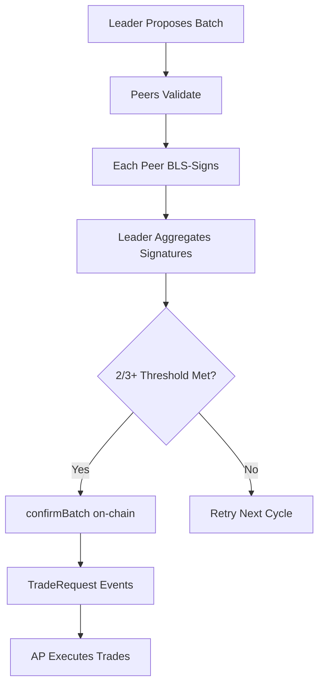

# Oracle Nodes

Three machines agree every second. This is more than most committees achieve in a year.

Written in Rust (68K LOC), the oracle nodes are the consensus layer of the protocol. They batch orders, coordinate BLS signing across peers, and submit confirmed batches on-chain. One-second cycles. Round-robin leaders. No meetings.

## What They Do

Five obligations, repeated every second, without complaint:

- Collect pending orders from the Index contract
- Propose batches and coordinate BLS multi-party signing
- Submit confirmed batches on-chain with aggregated signatures
- Trigger rebalancing when ITP weights are updated
- Maintain price consensus for NAV computation

## Key Modules

| Module | Responsibility |
|---|---|
| **consensus/** | BLS signature aggregation, threshold validation, batch agreement protocol |
| **cycle/** | 1-second cycle state machine with 5 phases (200ms each) |
| **p2p/** | TCP transport with TLS, peer discovery (static config + on-chain registry) |
| **chain/** | Ethereum/L3 RPC interaction, transaction submission, event monitoring |
| **netting/** | Order netting engine — matches opposing orders, handles USDT pair routing, computes net exposure |
| **leader/** | Round-robin leader election, batch proposal construction |
| **price/** | Price feed aggregation from data node, consensus on prices used in batches |
| **state/** | Local state management, pending order tracking, batch history |

## Consensus Flow

Agreement is not optional. The protocol requires it on every batch.



<Info>
  The BLS threshold of `ceil(2n/3)` ensures Byzantine fault tolerance — the oracle nodes can tolerate up to `floor((n-1)/3)` malicious or offline oracle nodes while still making progress.
</Info>

## Cycle Timing

One second. Five phases. 200 milliseconds each. The precision is not aspirational -- it is enforced.

| Phase | Duration | Action |
|---|---|---|
| **COLLECT** | 200ms | Gather new pending orders from chain events and peer gossip |
| **PROPOSE** | 200ms | Leader constructs and broadcasts the proposed batch |
| **SIGN_SUBMIT** | 200ms | Peer oracle nodes validate the proposal and return BLS partial signatures |
| **CONFIRM** | 200ms | Leader aggregates signatures and submits the confirmed batch on-chain |
| **REBALANCE** | 200ms | Process any pending ITP rebalance operations (weight updates → new quantities) |

```mermaid
gantt
    title 1-Second Consensus Cycle
    dateFormat X
    axisFormat %L ms
    section Phases
    COLLECT    :a, 0, 200
    PROPOSE    :b, 200, 400
    SIGN_SUBMIT :c, 400, 600
    CONFIRM    :d, 600, 800
    REBALANCE  :e, 800, 1000
```



## Leader Election

Round-robin. Deterministic. Based on the node's index in `OracleRegistry.sol`. The leader rotates every second.

The leader builds the proposal, aggregates signatures, and submits the batch. If a leader fails, the cycle is lost and the next leader takes over. No negotiation. No second chances.

## Peer-to-Peer Transport

| Property | Detail |
|---|---|
| **Transport** | TCP with TLS |
| **Discovery** | Static config + on-chain registry via `OracleRegistry.sol` |
| **Messages** | Batch proposals, BLS partial signatures, heartbeats |
| **Serialization** | Binary, because latency is not negotiable |

Persistent connections to all peers. Automatic reconnection. The P2P layer handles the messiness of networks so the consensus layer does not have to.

## Netting Engine

A buyer and a seller of the same asset in the same batch cancel each other out. Only the remainder reaches the exchange. This is not clever -- it is obvious. But obvious things must still be built.

- **Order netting** -- buy and sell for the same asset offset, reducing net AP execution
- **USDT pair routing** -- when direct pairs are unavailable
- **Rebalance deltas** -- on weight change, computes the minimal trades to move from old quantities to new while preserving NAV

## BLS Details

| Property | Detail |
|---|---|
| **Curve** | BN254 (alt_bn128) |
| **EVM compatibility** | Uses precompiles at `0x06` (addition), `0x07` (scalar multiplication), `0x08` (pairing) |
| **Key registration** | Each oracle node registers the node's BLS public key in `OracleRegistry.sol` |
| **Aggregation** | Partial signatures are aggregated into a single signature by the leader |
| **Verification** | On-chain via `BLSLib.sol` against the stored aggregated public key |

<Warning>
  BLS verification is **never bypassed** — not in local development, not in tests, not anywhere. If BLS is blocking development, the correct approach is to fix the BLS pipeline (generate proper test keys, register them in OracleRegistry, compute valid signatures), not to add bypass logic.
</Warning>

## Security: AP Isolation (FR13)

The oracles and the AP do not talk. They cannot. This is not a limitation -- it is the architecture.

<Warning>
  Oracle nodes **cannot communicate directly** with the AP. The AP discovers confirmed batches exclusively through on-chain `TradeRequest` events. This boundary exists because if the signers and the executor could coordinate off-chain, the system would have a single point of collusion.
</Warning>

```text
  Oracle Nodes                L3 Chain                AP
  ┌───────────┐         ┌──────────────┐        ┌─────────┐
  │           │────tx──►│  Index.sol   │        │         │
  │  Consensus│         │              │──event─►│ Execute │
  │  + BLS    │         │ confirmBatch │        │  Fills  │
  │           │         │  emits event │        │         │
  └───────────┘         └──────────────┘        └─────────┘
        ▲                                            │
        │              No direct link                │
        └────────────── ✕ ───────────────────────────┘
```
