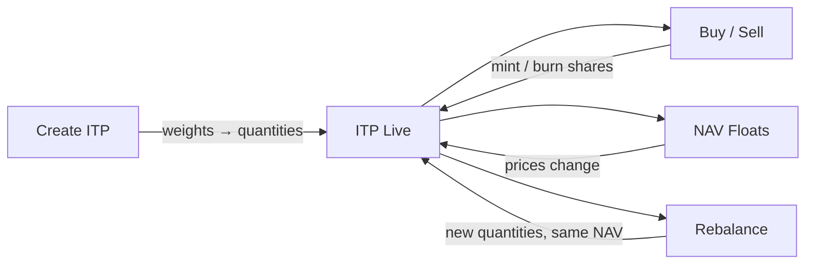

# Index Tracking Products (ITPs)

An ITP is a basket. Like all baskets, it holds things that will disappoint you at different rates. The virtue of the basket is that the disappointments cancel each other out — sometimes. The NAV tells you how the cancellation is going.

## Quick Start: Buy an ITP

```bash
# Check ITP price (NAV)
curl https://generalmarket.io/api/prices/{itpId}

# Buy on-chain
index.submitOrder(itpId, usdcAmount, OrderType.BUY)
```

See [Buy & Sell Guide](/index/guides/buy-sell) for the full step-by-step.

## ITP Lifecycle



## What Makes Up an ITP

An ITP is four things. No more.

- **A basket of assets** -- up to 100 crypto assets with defined weights
- **Fixed per-share quantities** -- each share represents a fixed amount of each underlying asset
- **An ERC-4626 vault token** -- the standard vault interface, so it composes with everything else in DeFi
- **A deployer** -- the address that built the basket and earns fees for the trouble

<Info>
Up to **100 assets** per basket. You can build a market-wide index or a narrow conviction play. The protocol does not judge your allocation. The market will.
</Info>

## NAV Pricing

Every ITP has a **Net Asset Value (NAV)**. It is the fair value of one share, computed from the prices of everything inside the basket. NAV is the only number that matters. It is also the only number that never stops moving.

### NAV Computation Formula

```solidity
NAV = sum(qty[i] * price[i]) / 1e18
```

Where:
- `qty[i]` is the fixed per-share quantity of asset `i`
- `price[i]` is the current market price of asset `i`
- The division by `1e18` normalizes to a human-readable value

The same formula runs on-chain in `Index.sol`, off-chain in the oracle nodes, and in the frontend. Three places, one truth. If they ever disagree, something is very wrong.

## ITP Creation: How Quantities Are Set

Every ITP begins its life worth exactly **$1** (`1e18` in contract math). A deployer chooses weights. The protocol converts those weights into fixed per-share quantities. From this moment on, the dollar figure is a memory. The quantities are the reality.

```solidity
qty[i] = (weight[i] * 1e18) / price[i]
```

### Three-Asset Creation Example

Three assets, equal weight. The most optimistic allocation: the belief that you cannot choose, so you choose equally.

| Asset | Weight | Price | Quantity per Share |
|-------|--------|-------|--------------------|
| BTC | 33.33% | $50,000 | 0.000006666 BTC |
| ETH | 33.33% | $3,000 | 0.000111100 ETH |
| SOL | 33.34% | $100 | 0.003334000 SOL |

At creation, NAV = $1.00. Each share represents exactly these quantities. The precision is comforting. The future will not be.

```solidity
NAV = (0.000006666 * 50000) + (0.000111100 * 3000) + (0.003334000 * 100)
    = 0.3333 + 0.3333 + 0.3334
    = $1.00
```

## ITP Key Invariants

Three rules. They do not bend.

<Note>
**Quantities only change on rebalance.** Buying and selling does not alter per-share quantities. Buy/sell mints or burns shares proportionally. The basket composition stays the same. This is the invariant that makes everything else possible.
</Note>

1. **Buy/sell = mint/burn shares.** You buy $100 at NAV $1.05, you receive ~95.24 shares. The quantities per share do not move.

2. **NAV drifts from $1 over time.** The basket appreciates, NAV rises. The basket falls, NAV falls. This is the point. An ITP that stays at $1 forever has failed at its only job.

3. **Quantities are stored on-chain.** The `_itpInventory` mapping in `IndexStorage.sol` is the canonical truth. Everything else is a reflection.

## ITP Rebalancing

A rebalance reshuffles the deck without changing the value of the hand. New quantities, same NAV. The deployer adjusts the composition — the value per share does not flinch.

### Rebalance Quantity Formula

```solidity
qty_new[i] = (w_new[i] * currentNAV) / price[i]
```

Where:
- `w_new[i]` is the new target weight for asset `i`
- `currentNAV` is the NAV at the moment of rebalance
- `price[i]` is the current price of asset `i`

### Rebalance Worked Example

Time passes. Prices move. BTC rises to $60,000, ETH to $3,500, SOL to $120. The ITP's NAV is now:

```solidity
NAV = (0.000006666 * 60000) + (0.000111100 * 3500) + (0.003334000 * 120)
    = 0.3999 + 0.3889 + 0.4001
    = $1.1889
```

The deployer decides the future looks different. New weights: BTC 50%, ETH 30%, SOL 20%.

| Asset | New Weight | Price | New Quantity |
|-------|-----------|-------|-------------|
| BTC | 50% | $60,000 | 0.000009908 |
| ETH | 30% | $3,500 | 0.000101906 |
| SOL | 20% | $120 | 0.001981500 |

Post-rebalance NAV check:

```solidity
NAV = (0.000009908 * 60000) + (0.000101906 * 3500) + (0.001981500 * 120)
    = 0.5945 + 0.3567 + 0.2378
    = $1.1890  (same as before, within rounding)
```

<Warning>
NAV is preserved. Exposure is not. After a rebalance, you hold the same dollar value but a different bet on the future. The value did not change. The conviction did.
</Warning>

## ITP ERC-4626 Vault Tokens

Every ITP is an [ERC-4626](https://eips.ethereum.org/EIPS/eip-4626) vault. A standard interface. Standards are dull. They are also the reason your tokens work everywhere.

- **Fungible** -- all shares of the same ITP are identical. Your share and my share are the same share.
- **Transferable** -- send ITP tokens to any address. Ownership is portable.
- **Collateralizable** -- use ITP tokens as collateral in [lending markets](/index/concepts/lending). Borrow against what you believe in.
- **18 decimals** -- matching ERC-20 conventions. Precision beyond what any human needs.

## Technical Details

Where the formula lives, for those who need to see the source. Trust, but verify. Or rather — do not trust, and verify.

### Implementation Reference

| Layer | Location | Function |
|-------|----------|----------|
| Contract | `Index.sol` | `createITP()` -- computes initial quantities from weights and prices |
| Contract | `Index.sol` | `_getCurrentPrice()` -- computes NAV from stored inventory |
| Contract | `Index.sol` | `updateWeights()` -- rebalance: recalculates quantities preserving NAV |
| Storage | `IndexStorage.sol` | `_itpInventory[itpId]` -- canonical per-share quantities |
| Oracle | `nav.rs` | `calculate_nav()` -- reads inventory via `getITPState` |
| Frontend | `useItpNav.ts` | Inventory-first calculation, weight fallback for legacy ITPs |
