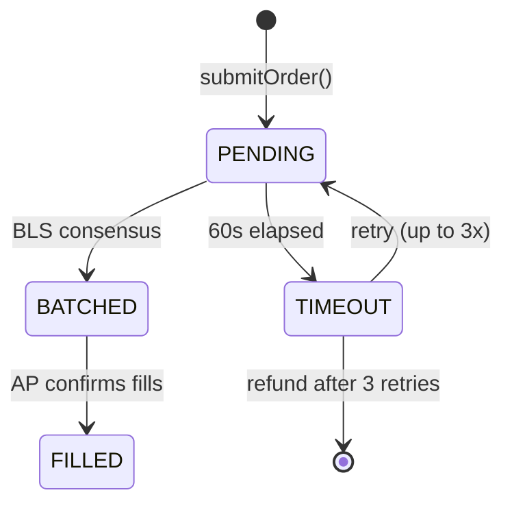

# Order Lifecycle

You click a button. Behind that click, three machines decide whether to trust each other. They agree in under a second. A real exchange executes a real trade. Tokens appear in your wallet. The entire journey takes less time than reading this paragraph. Here is what happens in that silence.

## Buy Flow

Six steps between your USDC and your tokens. Each one can fail. None of them do, almost always.

<Steps>
  <Step title="User Submits Buy on L3">
    `submitOrder(itpId, amount, BUY)`. Your USDC is **escrowed** on L3. It is no longer yours. It is not yet theirs. It belongs to the protocol until the machines have finished agreeing.
  </Step>
  <Step title="Oracle Bridges Buy to Settlement">
    The oracle nodes detect the pending buy order, reach BLS consensus, and relay it to the Settlement chain. Your USDC intent crosses the chain boundary — cryptographically signed, not optimistically assumed.
  </Step>
  <Step title="completeBuyOrder Releases USDC to AP">
    `completeBuyOrder()` is called on Settlement with a valid BLS signature. The contract verifies the signature and releases the escrowed USDC to the AP vault. The money is now in the hands of the entity that will spend it. This step **must succeed** before any shares are minted. The backing invariant is enforced here, nowhere else.
  </Step>
  <Step title="AP Buys Underlying Assets">
    The Authorized Participant receives the USDC and buys the underlying assets on **Bitget**. Real order books. Real counterparties. The abstraction ends here.
  </Step>
  <Step title="confirmFills Mints Shares on L3">
    `confirmFills()` is called on L3. The contract checks each fill against the **0.1% price tolerance**. If it passes, ITP shares are **minted** to your wallet. The exposure begins.
  </Step>
  <Step title="BridgedITP Minted on Settlement">
    `mintBridgedShares()` is called on Settlement with BLS verification. A BridgedITP token — an ERC-20 replica of your L3 shares — is minted to your wallet on Settlement. You now hold the same position on both chains.
  </Step>
</Steps>

### Buy Flow — Full Infrastructure Diagram


<Info>
The buy flow touches two chains and requires four BLS consensus rounds. The critical invariant: `completeBuyOrder` on Settlement must succeed before shares are minted anywhere. If it fails, `refundBuyOrder` returns your USDC. No shares minted, no damage done. See the [Bridge Architecture](/index/architecture/bridge) for the full cross-chain diagram.
</Info>

## Sell Flow

Selling is the buy flow in reverse — except the money must cross a chain boundary before it reaches you. The same consensus, the same execution, the same refusal to cut corners. Only the direction changes, and with it, the emotion.

<Steps>
  <Step title="Submit Sell Order on L3">
    `submitOrder(itpId, amount, SELL)`. Your ITP shares are **escrowed** on L3. They are no longer yours. They are not yet gone. You have decided to leave, but the protocol has not yet agreed.
  </Step>
  <Step title="Oracle Bridges Sell to Settlement">
    The oracle nodes detect the pending sell order, reach BLS consensus, and relay it to the Settlement chain. The sell intent crosses the chain boundary — cryptographically signed, not optimistically assumed.
  </Step>
  <Step title="AP Sells Underlying Assets">
    The Authorized Participant receives the `TradeRequest` and sells the underlying assets on **Bitget**. Real order books, real counterparties. The abstraction ends here, as it does for buys.
  </Step>
  <Step title="AP Returns USDC to Settlement Custody">
    The AP deposits the USDC proceeds into the Settlement custody contract. The money exists. It is accounted for. It is not yet yours.
  </Step>
  <Step title="completeSellOrder Transfers USDC to User">
    `completeSellOrder()` is called on Settlement with a valid BLS signature. The contract verifies the signature, transfers USDC from the AP vault to your wallet on Settlement. You are whole again. Or less than whole. The math will tell you.
  </Step>
  <Step title="confirmFills Burns Shares on L3">
    `confirmFills()` is called on L3. The escrowed ITP shares are **burned**. The position ceases to exist on both chains simultaneously. What was yours is now no one's.
  </Step>
</Steps>

### Sell Flow — Full Infrastructure Diagram


<Info>
The sell flow touches two chains and requires four BLS consensus rounds. The USDC arrives on Settlement, not on L3. If you deposited from Settlement, this is where you expect it. If you traded natively on L3, the bridge handles the conversion. See the [Bridge Architecture](/index/architecture/bridge) for the full cross-chain diagram.
</Info>

## Cycle Timing

One second. Five phases. The oracle nodes run this cycle continuously, without pause, without weekends. The machines do not tire. That is their advantage over you.

```mermaid
gantt
    title 1-Second Consensus Cycle
    dateFormat X
    axisFormat %L ms
    section Phases
    COLLECT    :a, 0, 200
    PROPOSE    :b, 200, 400
    SIGN       :c, 400, 600
    CONFIRM    :d, 600, 800
    REBALANCE  :e, 800, 1000
```



| Phase | Duration | What Happens |
|-------|----------|--------------|
| **COLLECT** | 200ms | Oracle nodes scan for new pending orders on-chain |
| **PROPOSE** | 200ms | Leader proposes a batch of collected orders |
| **SIGN_SUBMIT** | 200ms | Peer oracle nodes validate and BLS-sign the batch; leader aggregates and submits |
| **CONFIRM** | 200ms | Batch confirmation transaction is processed on-chain |
| **REBALANCE** | 200ms | Any pending rebalance operations are executed |

<Info>
An order is batched within 1-2 seconds. Full settlement, including exchange execution, completes in under 10 seconds. Fast enough that you cannot change your mind. Which is, perhaps, the point.
</Info>

## Order States

Four states. An order is born, batched, filled, or abandoned. There is no fifth state. There is no ambiguity.



| State | Description |
|-------|-------------|
| `PENDING` | Order submitted and USDC/tokens escrowed. Waiting for next cycle. |
| `BATCHED` | Included in a confirmed batch with valid BLS signature. AP is executing. |
| `FILLED` | AP reported fills, tokens minted/burned, settlement complete. |
| `TIMEOUT` | Order was not filled within 60 seconds. Retried up to 3 times before escrowed funds are returned. |

## Safeguards

What stands between your money and catastrophe.

### BLS Consensus

Every batch requires a supermajority: `ceil(2n/3)` of registered oracles. Three nodes, at least two must sign. Twenty nodes, at least fourteen. The math is simple. The discipline is not.

<Warning>
BLS verification is **never bypassed**. Not in production. Not in testing. Not in local development. There is no test mode. There is no override. This is the one rule the protocol will not negotiate.
</Warning>

### Price Tolerance

The AP must execute within **0.1%** of the reference price. `confirmFills()` validates every fill on-chain. Report a price outside the band and the fill is rejected. The tolerance is narrow because trust should be narrow.

```text
|reference_price - fill_price| / reference_price <= 0.001
```

### Order Timeout

Sixty seconds. If the world has not responded by then, the order enters timeout.

1. First timeout: automatic retry. The protocol is patient.
2. Second timeout: another retry. The protocol is stubborn.
3. Third timeout: the order is cancelled. Your USDC or ITP tokens are returned. The protocol is not foolish.

<Note>
Timeouts are rare. They exist for the moments when exchanges go dark or networks congest. The safety net you never think about until the floor disappears.
</Note>

### Oracle-AP Separation

Oracle nodes and the Authorized Participant cannot speak to each other. The oracles read on-chain fill data and nothing more. This separation exists because the consensus layer and the execution layer must not collude. Systems fail when the watchers and the doers become friends.

## Netting

Buyers and sellers in the same cycle cancel each other out. $10,000 in buys, $7,000 in sells — only the net $3,000 goes to the exchange. The protocol matches what it can internally. Less trading, less cost, less exposure to the exchange. Elegance is the elimination of the unnecessary.
