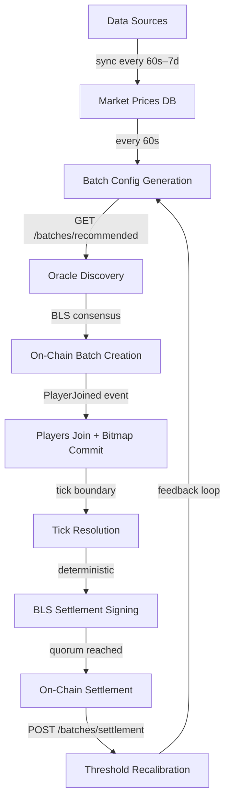

# Batch Lifecycle

A batch is born from data, consecrated by consensus, inhabited by strangers, and dissolved by mathematics. Nine phases. Three machines that must agree. One contract that trusts none of them. This is the full ceremony, end to end.



---

## Phase 1: Market Data Ingestion

The data-node polls the world. One hundred sources — CoinGecko, weather APIs, FRED, Bloomberg, transit networks, election trackers — each on its own schedule. A `SyncEngine` per source, staggered startup, rate-limited, circuit-broken. The data arrives and is stored in two places:

- **`market_prices`** — complete price history, 365-day retention
- **`market_prices_latest`** — deduplicated snapshot, one row per (source, asset_id), indexed for fast reads

Each oracle runs its own data-node instance. They poll the same APIs, store their own copies, compute their own snapshots. Three independent databases. If one data-node hallucinates a price, the other two ignore it. Paranoia, distributed across machines.

A fourth data-node, read-only, serves the frontend and bot APIs. It holds no signing authority. It cannot influence resolution.

---

## Phase 2: Batch Config Generation

Every 60 seconds, the `BatchEngine` wakes and builds a recommended config for each source. The work is threshold calibration — computing the price-change boundary that splits outcomes 50/50.

### Three-Stage Threshold Computation

The engine wants a threshold where half of future ticks resolve UP and half resolve DOWN. It tries three methods, falling through on failure:

**Stage 1 — Median of Past Settlements.** Query the `batch_settlements` table for the last N actual price changes per asset. Take the median (`PERCENTILE_CONT(0.5)`). The median is 50/50 by construction: half of future values should exceed it, half should not. This is the primary method, and when data exists, it is remarkably accurate.

**Stage 2 — Last Settlement Change.** If no settlement history exists, use the most recent batch's actual price change and apply volatility bands:

| Change | Resolution | Threshold |
|--------|-----------|-----------|
| < 0.3% | `flat_x` | 30 bps |
| 0.3–3% | `up_x` | 30 bps |
| 3–30% | `up_300` | 300 bps |
| > 30% | `up_3000` | 3000 bps |

**Stage 3 — 24h Price History.** If settlement history is empty, compute the 24-hour high/low range and apply the same volatility bands.

**Stage 4 — Source Default.** Last resort. Use the source's hardcoded `zero_trend_type` and minimum threshold.

### Healthy Asset Selection

Not every asset makes the cut. The engine queries `market_prices_latest` for assets with:
- A price fresher than 10× the source's sync interval
- A value greater than zero
- Sorted by `asset_id` for deterministic ordering

Maximum 8,192 markets per batch (the on-chain bitmap is 1,024 bytes).

### Config Hash

The config is sealed with a deterministic hash:

```
market_hashes = [keccak256(abi.encode(asset_id, resolution_type, threshold_bps)) for each market]
markets_root  = keccak256(concat(sorted(market_hashes)))
config_hash   = keccak256(abi.encode(source_id, tick_duration, lock_offset, markets_root))
```

This hash is what the oracles sign. Any difference in market selection, ordering, or threshold produces a different hash, and consensus fails. Determinism is not optional.

---

## Phase 3: Oracle Discovers Config

The oracle's lifecycle manager runs a per-source heartbeat, staggered across sources to prevent thundering herd. Each heartbeat:

1. **Fetches** the latest recommended config from `GET /batches/recommended`
2. **Extracts** the `config_hash`, `tick_duration`, `lock_offset`, and full market list
3. **Records** intent in the `vision_batch_lifecycle` Postgres table

The previous batch — the one that was active during the last heartbeat — now becomes the batch to resolve. A new batch creation is attempted simultaneously. The system breathes in two directions: creating the next round while settling the last.

---

## Phase 4: BLS Consensus and On-Chain Creation

Only the leader oracle (node index 0) submits on-chain. The others co-sign.

### Leader Flow

1. **Construct the BLS message:**
   ```
   message = keccak256(abi.encode(
       chainId,
       visionAddress,
       "CREATE_BATCH",
       sourceId,
       configHash,
       tickDuration,
       lockOffset
   ))
   ```

2. **Sign** with the leader's BLS private key.

3. **Broadcast** a `VisionCreateBatchProposal` via P2P to all followers.

4. **Collect co-signs.** Wait up to 30 seconds. Each follower verifies the proposal independently — same config hash, same parameters — and sends back a BLS signature. The leader collects them until the threshold is met: `ceil(2n/3)`. With three oracles, that is two signatures.

5. **Aggregate.** All collected signatures are merged into a single aggregated BLS signature. A signer bitmask records which oracles participated.

6. **Submit on-chain:**
   ```solidity
   vision.createBatch(
       sourceId, configHash, tickDuration, lockOffset,
       blsSignature, referenceNonce, signersBitmask
   )
   ```

7. **Parse receipt.** The `BatchCreated` event in the transaction receipt contains the on-chain `batchId` — the batch's permanent identity.

### Follower Flow

Followers do not submit. They receive the leader's P2P proposal, verify it against their own data-node's recommended config, sign if it matches, and send the signature back. After the leader submits, each follower's chain listener detects the `BatchCreated` event on L3 and registers the batch in its local scheduler.

---

## Phase 5: Players Join

A player calls `joinBatchDirect` on the Vision contract:

```solidity
vision.joinBatchDirect(batchId, configHash, depositAmount, stakePerTick, bitmapHash)
```

- USDC is transferred from the player's wallet to the contract
- The `bitmapHash` is a `keccak256` commitment — the player's predictions, sealed
- The lock window enforces timing: no joins during the final `lockOffset` seconds of a tick

The oracle's chain listener detects the `PlayerJoined` event and registers the player in the in-memory scheduler. The player then submits the actual bitmap bytes to the oracle API (`POST /vision/bitmap`), where the hash is verified against the on-chain commitment.

### Two-Slot Bitmap Model

Each player has two bitmap slots per batch:

| Slot | Purpose |
|------|---------|
| **Pending** | Where new bitmap submissions land during the current tick |
| **Active** | Where the resolver reads from at tick boundary |

At every tick boundary, pending is promoted to active. A player who submits nothing keeps their previous bitmap. A player who never submitted is voided — full deposit refund, no participation.

Each bitmap carries a `config_hash`. This ensures that a config update between submission and resolution cannot scramble market positions. Bit 0 is always the market the player intended, regardless of what the current config says.

---

## Phase 6: Tick Resolution

When the heartbeat fires and a `previous_batch_id` is ready for resolution, the oracle runs a deterministic pipeline.

### Step 1: Gather State

```rust
scheduler.get_batch_state(batch_id) → (Batch, Vec<PlayerPosition>)
```

### Step 2: Fetch Prices

The oracle queries the data-node for the market config (`GET /batches/config/:hash`) and a price snapshot (`GET /vision/snapshot`). For each market:

- **End price**: the latest value from the snapshot, scaled to 18 decimals
- **Start price**: derived from `change_pct`: `start = end / (1 + change_pct / 100)`
- **Staleness check**: if the price timestamp is older than the configured threshold, the market is cancelled — all players refunded for that market

### Step 3: Bitmap Flip

```rust
bitmap_store.flip(batch_id)
```

Pending bitmaps merge into active. Players with new submissions get updated predictions. Players without submissions keep their previous bitmap.

### Step 4: Per-Market Resolution

For each market in the batch:

1. **Compute percent change** from start to end price (integer basis points)
2. **Apply resolution type** + threshold to determine outcome: Up, Down, Flat, or Cancelled
3. **Decode each player's bitmap bit** for this market index (1 = UP, 0 = DOWN)
4. **Compute flat stake**: each player's `deposit / num_markets` per market. Remainder is redistributed one extra unit to the first N markets.

### Step 5: Parimutuel Side Matching

For markets with a clear winner:

1. Split players into winners (correct side) and losers (wrong side)
2. `matched = min(winner_total, loser_total)`
3. Winners receive: their matched stake back, plus a proportional share of the losers' matched pool
4. Losers forfeit their matched stake; unmatched excess is refunded
5. Edge cases — all same side, all losers, flat, cancelled — produce full refunds

```
Example: UP pool = 300 USDC, DOWN pool = 100 USDC, outcome = UP

matched = min(300, 100) = 100
Winners share 200 (their 100 back + losers' 100)
Losers receive 0
Unmatched UP excess (200) refunded to UP players proportionally
```

The total payout always equals the total deposits. No USDC is created or destroyed. Money changes hands. That is all a market does.

### Step 6: Aggregate Settlement

```rust
compute_settlement(&tick_result, &player_deposits) → RoundSettlement
```

Per-player payouts and refunds are summed across all markets. Players are sorted by address ascending — a contract requirement. The result:

```rust
RoundSettlement {
    batch_id: u64,
    players: Vec<Address>,      // sorted ascending
    payouts: Vec<U256>,         // 18-decimal L3 USDC
    deposits: Vec<U256>,        // per-player original deposit
    correct_counts: Vec<u32>,   // markets predicted correctly
    total_markets: u32,
}
```

Every oracle computes this independently. Same config, same prices, same bitmaps, same integer arithmetic. The results must be identical. If they are not, nothing happens — which is the only safe response to disagreement.

---

## Phase 7: BLS Settlement Signing

Each oracle signs the settlement independently and contributes to a shared aggregation in Postgres.

### Per-Oracle Process

1. **Compute the deterministic message hash:**
   ```
   payouts_hash = keccak256(abi.encode(players[], payouts[]))
   message_hash = keccak256(abi.encode(
       chainId,
       visionAddress,
       "SETTLE_BATCH",
       batchId,
       payoutsHash
   ))
   ```

2. **Sign** with the oracle's BLS private key.

3. **Shared DB aggregation** (`vision_settlement_proofs` table, `SELECT FOR UPDATE`):
   - First oracle to arrive: inserts `(batch_id, players_hash, bls_sig, bitmap = 1 << node_index)`
   - Subsequent oracles: verify `players_hash` matches, aggregate the BLS signature, update the signer bitmap

4. **Check quorum.** When `popcount(bitmap) >= threshold` and the batch has not yet been submitted:
   - Execute `settleBatch` on-chain
   - Mark `submitted = true`

The `players_hash` check is a guard against divergence. If two oracles computed different payouts — different prices, different bitmap sets, different resolution — their hashes will not match. The second oracle skips signing rather than corrupt the aggregated signature. Silence, in cryptography, is a form of honesty.

---

## Phase 8: On-Chain Settlement

The oracle with quorum calls:

```solidity
vision.settleBatch(
    batchId,
    players[],       // sorted ascending by address
    payouts[],       // 18-decimal USDC
    blsSignature,
    referenceNonce,
    signersBitmask
)
```

The contract validates:
- BLS signature against the aggregated public key in `OracleRegistry`
- Solvency: `sum(payouts) <= sum(deposits)`
- Player array is strictly ascending by address
- Batch has not already been settled

On success:
- 0.05% protocol fee deducted from **profit only** (not from deposits)
- USDC transferred directly to each player's wallet
- `PlayerSettled` event emitted per player
- `BatchSettled` event emitted for the batch
- `batch.settled = true` — prevents double settlement

---

## Phase 9: Settlement Feedback

After resolution, the oracle sends outcomes back to the data-node:

```
POST /batches/settlement
```

```json
{
  "source_id": "crypto",
  "asset_id": "bitcoin",
  "config_hash": "0x...",
  "start_price": "45000.5",
  "end_price": "45750.25",
  "change_pct": "1.67"
}
```

These records land in the `batch_settlements` table. The next time the `BatchEngine` runs (within 60 seconds), it reads the median of accumulated settlements and recalibrates thresholds for the next batch.

The loop closes. Outcomes inform future thresholds. Thresholds shape future outcomes. The system learns what 50/50 means for each asset — not through theory, but through the accumulated evidence of what actually happened. Empiricism, running on a 60-second cycle.

---

## The Complete Pipeline

```
┌─────────────────────────────────────────────────────────────────────────┐
│                           DATA NODE                                     │
│                                                                         │
│  100 Sources ──► SyncEngine ──► market_prices_latest                    │
│                                       │                                 │
│                                BatchEngine (60s)                        │
│                                       │                                 │
│                            batch_configs (DB + memory)                  │
│                                       │                                 │
│                          GET /batches/recommended                       │
└───────────────────────────────┬─────────────────────────────────────────┘
                                │
┌───────────────────────────────▼─────────────────────────────────────────┐
│                           ORACLE (×3)                                   │
│                                                                         │
│  Lifecycle Manager (heartbeat per source)                               │
│       │                                                                 │
│       ├──► Create new batch (BLS consensus → createBatch on-chain)      │
│       │                                                                 │
│       └──► Resolve previous batch:                                      │
│                1. Fetch config + prices from data-node                  │
│                2. Flip bitmaps (pending → active)                       │
│                3. Per-market resolution (prices → outcome → matching)   │
│                4. Compute settlement (deterministic payouts)            │
│                5. BLS sign → aggregate in Postgres                      │
│                6. Submit settleBatch when quorum reached                │
│                7. POST settlement outcomes back to data-node            │
│                                                                         │
└───────────────────────────────┬─────────────────────────────────────────┘
                                │
┌───────────────────────────────▼─────────────────────────────────────────┐
│                         L3 BLOCKCHAIN                                   │
│                                                                         │
│  Vision.sol                                                             │
│       ├── createBatch() → BatchCreated event                            │
│       ├── joinBatchDirect() → PlayerJoined event                        │
│       ├── updateBitmap() → BitmapUpdated event                          │
│       ├── settleBatch() → PlayerSettled + BatchSettled events            │
│       └── pause() / unpause()                                           │
│                                                                         │
│  VisionReserve.sol                                                      │
│       └── USDC custody — deposits, withdrawals, reward transfers        │
│                                                                         │
│  OracleRegistry.sol                                                     │
│       └── BLS public keys, aggregated pubkey, threshold                 │
│                                                                         │
└─────────────────────────────────────────────────────────────────────────┘
```

---

## Key Invariants

| Property | Guarantee |
|----------|-----------|
| **Determinism** | All oracles compute identical results — same config, same prices, same bitmaps, same integer math |
| **Zero-sum** | Total payouts = total deposits. No USDC created or destroyed |
| **BLS threshold** | `ceil(2n/3)` signatures required for every state-changing operation |
| **Solvency** | Contract rejects any settlement where `sum(payouts) > sum(deposits)` |
| **Idempotency** | `batch.settled` flag prevents double settlement |
| **Config integrity** | Per-bitmap `config_hash` ensures market-order consistency across config updates |
| **Player sorting** | `settleBatch` requires strictly ascending addresses — contract enforced |
| **Self-calibrating** | Threshold feedback loop drives outcomes toward 50/50 over time |

---

## Database Persistence

### Data Node

| Table | Content | Retention |
|-------|---------|-----------|
| `market_prices` | Complete price history | 365 days |
| `market_prices_latest` | Live snapshot per (source, asset) | Current state |
| `batch_configs` | Recommended configs | Signed: forever. Unsigned: 2 hours |
| `signed_batch_configs` | BLS-signed configs (source, hash, sig, nonce) | Forever |
| `batch_settlements` | Actual outcomes per (source, asset) | Forever |

### Oracle

| Table | Content | Retention |
|-------|---------|-----------|
| `vision_batches` | Batch metadata (id, source, config, state) | Forever |
| `vision_positions` | Player deposits per batch | Forever |
| `vision_batch_lifecycle` | Intent + timing (start, end, deadline) | Forever |
| `vision_round_players` | Per-player settlement results | Forever |
| `vision_settlement_proofs` | BLS aggregation state (hash, sig, bitmap, submitted) | Forever |
| `vision_bitmaps` | Bitmap storage (batch, player, bytes, hash) | Forever |

On crash recovery, the oracle loads all non-settled batches and all positions with balance > 0 from these tables. The in-memory state is rebuilt from Postgres. The machine forgets nothing that matters.

---

## Timing

| Event | Interval |
|-------|----------|
| Price fetching | Per source (60s to 604,800s) |
| Batch config generation | Every 60 seconds |
| Oracle heartbeat | Per source, staggered across sources |
| BLS co-sign collection | Up to 30 seconds per batch creation |
| Tick duration | Configurable per source (60s to 2,592,000s) |
| Lock window | Final `lockOffset` seconds of each tick |
| Settlement feedback | Immediately after resolution |
| Threshold recalibration | Next BatchEngine cycle (within 60s) |
