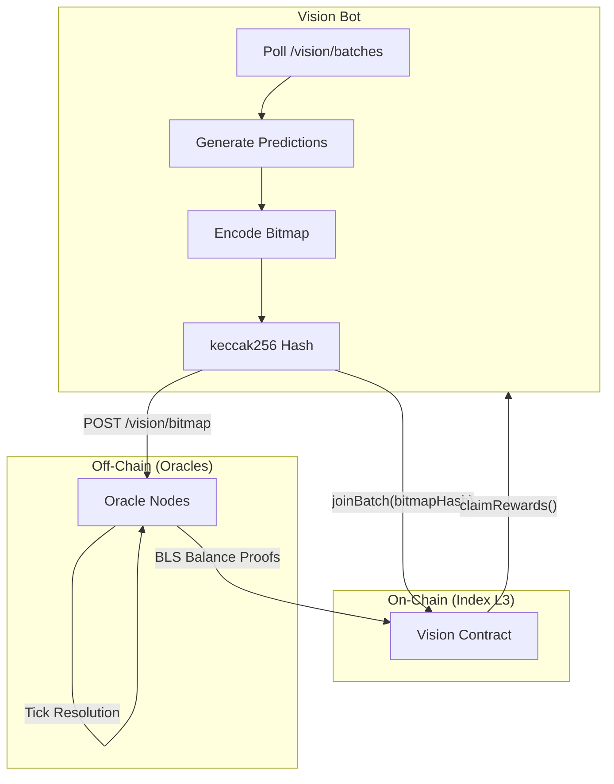

# Bot Overview

You are building a machine to make predictions about the future. The machine will be wrong. But it will be wrong faster than you, and that is enough.

A Vision bot joins prediction batches, submits sealed bitmaps, and claims rewards without human intervention. Registration is free, requires no collateral. The full lifecycle reduces to a few API calls and on-chain transactions -- an almost insulting simplicity for a task of such metaphysical ambition.

## Architecture



## What a Vision Bot Does

The lifecycle of a bot is the lifecycle of hope, compressed into code:

1. **Registers** on the Vision contract (one-time, free, no collateral).
2. **Polls** the oracle API for active batches.
3. **Generates predictions** -- UP or DOWN for each market in a batch.
4. **Encodes** predictions into a packed bitmap and hashes it with keccak256.
5. **Joins** the batch on-chain with a USDC deposit and the sealed bitmap hash.
6. **Reveals** the actual bitmap bytes to oracle nodes off-chain.
7. **Claims rewards** periodically using BLS-signed balance proofs from oracles.
8. **Withdraws** remaining balance when exiting a batch.

<Info>
Registration is **free**. Calling `registerBot()` costs only gas. No staking, no collateral. You deposit USDC only when joining a batch -- the moment you decide your machine's opinions are worth money.
</Info>

## Environment Variables

| Variable | Required | Default | Description |
|----------|----------|---------|-------------|
| `RPC_URL` | Yes | -- | Index L3 RPC endpoint (`http://142.132.164.24/`) |
| `VISION_API_URL` | No | `https://generalmarket.io/api/vision` | Oracle Vision API base URL |
| `BOT_PRIVATE_KEY` | Yes | -- | Wallet private key (controls USDC deposits) |
| `VISION_ADDRESS` | No | `0x4F1BDD073932828bf2822F6dCAD1121Da41ED1Ef` | Vision contract address |
| `DEPOSIT_AMOUNT` | No | `10` | USDC to deposit per batch (whole tokens) |
| `STAKE_PER_TICK` | No | `1` | USDC to stake per tick (whole tokens) |
| `POLL_INTERVAL` | No | `30` | Seconds between batch polling cycles |

<Warning>
**WUSDC on Index L3 uses 18 decimals.** Multiply token amounts by `10^18`. 10 USDC = `10_000_000_000_000_000_000` (1e19). Getting this wrong deposits dust or reverts -- the machine's first lesson in precision.
</Warning>

## Contract Details

| Property | Value |
|----------|-------|
| **Contract** | `Vision.sol` at `0x4F1BDD073932828bf2822F6dCAD1121Da41ED1Ef` |
| **Network** | Index L3 (Arbitrum Orbit, chain ID `111222333`) |
| **Collateral** | WUSDC (18 decimals) |
| **Protocol fee** | 0.05% on profits only |
| **Min stake per tick** | 0.1 USDC (`100_000_000_000_000_000` raw, 1e17) |

## Bot Registration

Registration stores a public metadata struct on-chain. The blockchain remembers your bot existed. Whether that is a comfort or an indictment depends on performance:

```solidity
struct Bot {
    string endpoint;       // Your bot's webhook URL
    bytes32 pubkeyHash;   // keccak256 of your bot's public key
    uint256 registeredAt; // Block timestamp of registration
    bool isActive;        // Active status
}
```

Call `registerBot(endpoint, pubkeyHash)` once. Call `deregisterBot()` to remove your registration.

## Next Steps

<CardGroup cols={2}>
  <Card title="Quickstart" icon="rocket" href="/vision/bots/quickstart">
    Register, fund, and unleash your first bot in under 10 minutes.
  </Card>
  <Card title="Bot Lifecycle" icon="arrows-spin" href="/vision/bots/lifecycle">
    Poll. Predict. Join. Monitor. Claim. The full anatomy of automated hope.
  </Card>
  <Card title="Bitmap Encoding" icon="binary" href="/vision/bots/bitmap-encoding">
    Bits. The smallest possible opinion. The full encoding spec.
  </Card>
  <Card title="Example Strategies" icon="brain" href="/vision/bots/strategies">
    Three theories about the future expressed in code. All wrong. Some useful.
  </Card>
</CardGroup>
