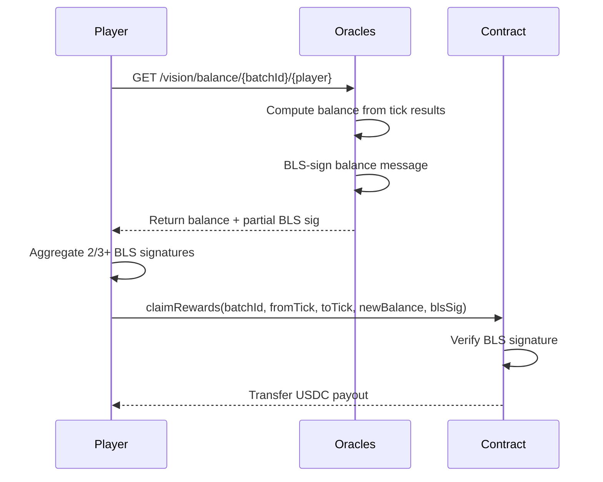

Three machines sign your balance. If two agree, you can claim. Trust is a threshold, not an emotion. This is the architecture of belief in a system where nobody trusts anyone -- and that, paradoxically, is what makes it trustworthy.

## Quick Start: Check Your Balance

```bash
curl https://generalmarket.io/api/vision/balance/{batchId}/{playerAddress}
```

Response: `{ "batch_id": 1, "player": "0x...", "balance": "15000000", "stake_per_tick": "100000" }`

To claim on-chain, you need BLS-signed proofs from 2/3+ oracles. See [Bot Lifecycle](/vision/bots/lifecycle) for the full claim flow.

## BLS Verification Flow



## Why Off-Chain Balance Tracking?

Resolving every tick on-chain for every player in every market would be ruinously expensive. Gas costs would devour the stakes before anyone could win them. So Vision uses a hybrid architecture -- the pragmatist's compromise between idealism and reality:

- **On-chain**: Deposits, withdrawals, bitmap commitments, and BLS-verified claims.
- **Off-chain**: Tick resolution, bitmap reveals, balance computation, and BLS signing.

The contract does not know each player's balance after every tick. It trusts the oracle consensus: if 2/3+ of registered oracles agree on a player's balance, the contract accepts it. This is not blind faith. It is mathematics with a quorum.

## BLS Signature Flow

The balance proof lifecycle follows 5 steps. Each step is a negotiation between a player who wants money and machines that require proof. The machines always win this negotiation.

### Step 1: Player Requests Balance Proof

The player queries an oracle node for their current balance:

```bash
GET /vision/balance/{batchId}/{playerAddress}
```

**Response:**

```json
{
  "batch_id": 1,
  "player": "0xAbC...123",
  "balance": "15000000",
  "stake_per_tick": "100000"
}
```

<Info>
In the full implementation, each oracle returns a partial BLS signature. The player collects signatures from multiple oracles to aggregate.
</Info>

### Step 2: Oracles Compute Balance

Each oracle independently computes your balance. Three machines, working alone, arriving at the same number -- or not. The process:

1. Tracks all tick results since the player's last claim.
2. Sums deposits + winnings - losses - fees.
3. Arrives at the player's `newBalance`.

Since all oracles run the same deterministic resolution logic on the same price feeds and bitmaps, they should arrive at the same balance. When they do, it is consensus. When they do not, something is broken.

### Step 3: Oracles BLS-Sign the Balance

Each oracle signs the following message. The signature is the oracle's attestation: *I have computed this balance and I stake my cryptographic identity on it*:

```solidity
bytes32 message = keccak256(abi.encode(
    chainId,            // Chain ID (prevents cross-chain replay)
    contractAddress,    // Vision contract address
    "CLAIM",            // Action tag
    batchId,            // Batch ID
    playerAddress,      // Player's address
    fromTick,           // First tick in the claim range
    toTick,             // Last tick in the claim range
    newBalance          // Computed balance after all ticks
));
```

The player collects BLS partial signatures from at least 2/3 of registered oracles.

### Step 4: Player Aggregates and Submits

The player aggregates the partial BLS signatures into a single aggregated signature and submits it on-chain. Multiple voices, fused into one proof:

```solidity
function claimRewards(
    uint256 batchId,
    uint256 fromTick,
    uint256 toTick,
    uint256 newBalance,
    bytes calldata blsSignature  // Aggregated BLS signature
) external;
```

### Step 5: Contract Verifies and Pays

The contract performs its final duty -- verification followed by payment, or verification followed by silence:

1. Reconstructs the same message hash from the parameters.
2. Verifies the aggregated BLS signature against the oracle registry's aggregated public key.
3. If valid:
   - Compares `newBalance` to `oldBalance`.
   - If `newBalance > oldBalance`: computes winnings, deducts the 0.05% fee, and transfers the payout.
   - If `newBalance <= oldBalance`: records the loss (balance decreased), no payout.
4. Updates `position.lastClaimedTick = toTick`.

```solidity
if (newBalance > oldBalance) {
    uint256 winnings = newBalance - oldBalance;
    uint256 fee = (winnings * PROTOCOL_FEE_BPS) / BPS_DENOMINATOR;
    accumulatedFees += fee;
    uint256 payout = winnings - fee;
    USDC.safeTransfer(msg.sender, payout);
}
```

<Warning>
BLS verification is never bypassed. Not in local development, not in tests, not anywhere. If BLS verification is blocking your workflow, fix the BLS pipeline -- do not add bypass flags. There are no shortcuts in cryptography. There are only correct implementations and broken ones.
</Warning>

## Claiming vs. Withdrawing

Two doors out. One lets you take your winnings and stay. The other lets you take everything and leave. Both require proof that the money is yours:

### Claiming (Partial)

`claimRewards` lets a player claim accumulated winnings while staying in the batch:

```solidity
claimRewards(batchId, fromTick, toTick, newBalance, blsSig)
```

- Pays out the difference between old and new balance (minus fees).
- The player remains in the batch and continues playing.
- `lastClaimedTick` is updated to prevent double-claims.

### Withdrawing (Full Exit)

`withdraw` removes the player from the batch entirely:

```solidity
function withdraw(
    uint256 batchId,
    uint256 finalBalance,
    bytes calldata blsSignature
) external;
```

The BLS message for withdrawal uses the `"WITHDRAW"` action tag:

```solidity
bytes32 message = keccak256(abi.encode(
    chainId, contractAddress, "WITHDRAW",
    batchId, playerAddress, finalBalance
));
```

On withdrawal:
- Fees are calculated on **total profit** (finalBalance - totalDeposited), not just the last claim.
- The player's position is deleted from storage.
- All remaining USDC is transferred to the player.

### Force Withdraw

Oracles can force-withdraw a player via BLS consensus. This is the protocol's version of being asked to leave -- polite, cryptographically verified, and final:

```solidity
function forceWithdraw(
    uint256 batchId,
    address player,
    uint256 finalBalance,
    bytes calldata blsSignature
) external;
```

The BLS message uses the `"FORCE_WITHDRAW"` action tag. This is an oracle-level operation that requires consensus.

## Claim Guards

The contract enforces several safety checks. Every guard is a lesson learned from the history of broken protocols:

| Check | Error | Description |
|-------|-------|-------------|
| Player must have joined | `NotJoined` | `stakePerTick == 0` means not in batch |
| No double-claiming | `TickAlreadyClaimed` | `fromTick` must be after `lastClaimedTick` |
| Valid tick range | `InvalidTickRange` | `toTick >= fromTick` |
| BLS signature valid | `InvalidBLSSignature` | Aggregated signature must verify |
| Solvency | `InsolventPayout` | Contract must hold enough USDC |

## Code Example: Requesting a Proof

Here is a complete example of requesting a balance proof and submitting a claim. The code is straightforward. The money it moves is real:

```typescript
import { ethers } from "ethers";

const VISION_ABI = [
  "function claimRewards(uint256 batchId, uint256 fromTick, uint256 toTick, uint256 newBalance, bytes blsSignature)",
  "function getPosition(uint256 batchId, address player) view returns (tuple(bytes32 bitmapHash, uint256 stakePerTick, uint256 startTick, uint256 balance, uint256 lastClaimedTick, uint256 joinTimestamp, uint256 totalDeposited, uint256 totalClaimed))",
];

async function claimRewards(
  visionContract: ethers.Contract,
  batchId: number,
  oracleUrls: string[],
  playerAddress: string
) {
  // 1. Get current position
  const position = await visionContract.getPosition(batchId, playerAddress);
  const lastClaimed = position.lastClaimedTick.toNumber();

  // 2. Request balance proof from oracles
  const proofs = await Promise.all(
    oracleUrls.map(async (url) => {
      const resp = await fetch(`${url}/vision/balance/${batchId}/${playerAddress}`);
      return resp.json();
    })
  );

  // 3. Verify oracles agree on balance
  const balances = proofs.map((p) => p.balance);
  const agreed = balances.every((b) => b === balances[0]);
  if (!agreed) throw new Error("Oracles disagree on balance");

  // 4. Aggregate BLS signatures (simplified)
  const aggregatedSig = aggregateBLSSignatures(proofs.map((p) => p.bls_signature));

  // 5. Submit claim on-chain
  const fromTick = lastClaimed > 0 ? lastClaimed + 1 : position.startTick.toNumber();
  const toTick = proofs[0].to_tick;
  const newBalance = proofs[0].balance;

  const tx = await visionContract.claimRewards(
    batchId, fromTick, toTick, newBalance, aggregatedSig
  );
  await tx.wait();

  console.log(`Claimed rewards for ticks ${fromTick}-${toTick}`);
}
```

<Tip>
In practice, the Vision frontend and bot SDK handle BLS aggregation automatically. You do not need to implement BLS signature aggregation from scratch unless building a custom integration. The complexity is real, but it is hidden. Most beautiful things are.
</Tip>
