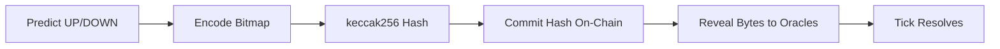

Your predictions are encoded in bits. One means up. Zero means down. The universe, reduced to binary. This is not a metaphor -- it is literally how the contract stores your opinion about the future of Bitcoin, the weather in Tokyo, and the disruption level of the Northern Line.

## Quick Start: Encode a Bitmap

Encode UP/DOWN predictions for 5 markets:

```python
from web3 import Web3
import math

def encode_bitmap(predictions: list[bool]) -> bytes:
    byte_count = math.ceil(len(predictions) / 8)
    bitmap = bytearray(byte_count)
    for i, is_up in enumerate(predictions):
        if is_up:
            bitmap[i // 8] |= 1 << (7 - (i % 8))
    return bytes(bitmap)

bitmap = encode_bitmap([True, False, True, True, False])  # UP, DOWN, UP, UP, DOWN
bitmap_hash = Web3.keccak(bitmap)
print(f"Bitmap: 0x{bitmap.hex()}, Hash: {bitmap_hash.hex()}")
```

See [Bitmap Encoding](/vision/bots/bitmap-encoding) for the full encoding guide.

## Bitmap Flow



## Sealed Commitment

Bitmaps are committed on-chain as a **keccak256 hash** before the actual bitmap bytes are revealed. Nobody can see your predictions. Nobody can copy them. Your beliefs are sealed inside a hash, invisible until the moment they are judged. There is a dignity in this -- the dignity of a private wager.

### Commitment Flow

1. **Player constructs bitmap** locally (array of UP/DOWN predictions).
2. **Player computes hash**: `bitmapHash = keccak256(bitmap)`.
3. **Player commits hash on-chain** by calling `joinBatch(batchId, deposit, stakePerTick, bitmapHash)` or `updateBitmap(batchId, newBitmapHash)`.
4. **Player reveals bitmap off-chain** by sending the actual bytes to oracles via `POST /vision/bitmap`.

```solidity
// On-chain: only the hash is stored
struct PlayerPosition {
    bytes32 bitmapHash;  // keccak256(bitmap)
    // ...
}
```

<Warning>
The keccak256 hash of the submitted bitmap bytes must match the on-chain `bitmapHash`. If they do not match, the oracle rejects the submission and the player's predictions are voided for that tick.
</Warning>

## Reveal Process

After committing the hash on-chain, the player must reveal the actual bitmap bytes to oracles before the tick resolves. The sealed prediction becomes public. What was private becomes shared. What was hope becomes arithmetic.

### Submitting to Oracles

```bash
curl -X POST https://oracle.example.com/vision/bitmap \
  -H "Content-Type: application/json" \
  -d '{
    "player": "0xYourAddress",
    "batch_id": 1,
    "bitmap_hex": "0xb0",
    "expected_hash": "0x..."
  }'
```

The oracle verifies:

1. The player exists in the batch (checked against the on-chain scheduler state).
2. The `expected_hash` matches the player's on-chain `bitmapHash` commitment.
3. `keccak256(bitmap_bytes) == expected_hash` (the bitmap is authentic).

If all checks pass, the bitmap is stored in memory for tick resolution.

### Reveal Window

After a tick ends, there is a configurable **reveal window** (default: 600 seconds) before bitmaps are made public. During this window, oracles use the bitmaps for resolution but do not expose them via the API. After the window expires, anyone can query revealed bitmaps:

```
GET /vision/reveal/{batch_id}/{tick_id}
```

<Tip>
Players can update their bitmap at any time by calling `updateBitmap(batchId, newBitmapHash)` on-chain, then revealing the new bitmap to oracles. The new bitmap takes effect starting from the next tick.
</Tip>

## Technical Details

### Bit Packing Specification

The encoding is precise. Each bit occupies an exact position. There is no ambiguity, no room for interpretation. In a world of shifting prices and uncertain outcomes, at least the encoding is certain. Bitmaps use **big-endian bit ordering** within each byte:

- Bit 0 = most significant bit (MSB) of byte 0
- Bit 7 = least significant bit (LSB) of byte 0
- Bit 8 = MSB of byte 1
- And so on...

```
Byte 0:  [bit0][bit1][bit2][bit3][bit4][bit5][bit6][bit7]
Byte 1:  [bit8][bit9][bit10][bit11][bit12][bit13][bit14][bit15]
...
```

Each bit maps to one market in the batch's `marketIds` array:

| Bit Value | Meaning |
|-----------|---------|
| `1` | Player predicts **UP** for this market |
| `0` | Player predicts **DOWN** for this market |

The bitmap size is `ceil(marketCount / 8)` bytes.

#### Visual Example

For a batch with 5 markets where a player predicts UP, DOWN, UP, UP, DOWN:

```
Markets:     [BTC] [ETH] [SOL] [AVAX] [MATIC]
Predictions:  UP    DOWN   UP    UP     DOWN
Bits:          1     0     1     1      0

Packed into byte 0: 1 0 1 1 0 0 0 0  = 0xB0
                     ^             ^
                  market 0     unused (padded with 0)
```

The bitmap is `0xB0` (1 byte).

### Encoding Examples

#### TypeScript

```typescript
function encodeBitmap(predictions: boolean[]): Uint8Array {
  const byteCount = Math.ceil(predictions.length / 8);
  const bitmap = new Uint8Array(byteCount);

  for (let i = 0; i < predictions.length; i++) {
    if (predictions[i]) {
      const byteIdx = Math.floor(i / 8);
      const bitIdx = 7 - (i % 8); // big-endian within byte
      bitmap[byteIdx] |= (1 << bitIdx);
    }
  }

  return bitmap;
}

// Example: 5 markets, predicting [UP, DOWN, UP, UP, DOWN]
const bitmap = encodeBitmap([true, false, true, true, false]);
// bitmap = Uint8Array([0xB0])  = 0b10110000
```

#### Python

```python
import math

def encode_bitmap(predictions: list[bool]) -> bytes:
    byte_count = math.ceil(len(predictions) / 8)
    bitmap = bytearray(byte_count)

    for i, is_up in enumerate(predictions):
        if is_up:
            byte_idx = i // 8
            bit_idx = 7 - (i % 8)  # big-endian within byte
            bitmap[byte_idx] |= (1 << bit_idx)

    return bytes(bitmap)

# Example: 5 markets, predicting [UP, DOWN, UP, UP, DOWN]
bitmap = encode_bitmap([True, False, True, True, False])
# bitmap = b'\xb0'  = 0b10110000
```

#### Decoding a Bit

To read a specific market's prediction from a bitmap:

```python
def get_bit(bitmap: bytes, index: int) -> bool:
    byte_idx = index // 8
    bit_idx = 7 - (index % 8)
    if byte_idx >= len(bitmap):
        return False
    return (bitmap[byte_idx] >> bit_idx) & 1 == 1
```

```typescript
function getBit(bitmap: Uint8Array, index: number): boolean {
  const byteIdx = Math.floor(index / 8);
  const bitIdx = 7 - (index % 8);
  if (byteIdx >= bitmap.length) return false;
  return ((bitmap[byteIdx] >> bitIdx) & 1) === 1;
}
```

### Edge Cases

Every system has edges. The interesting question is what happens when you reach them.

#### Unused Bits

If the number of markets does not fill the last byte, unused bits are padded with `0`. These unused bits are ignored during resolution -- they do not count as DOWN predictions.

For example, a batch with 3 markets only uses bits 0-2 of byte 0. Bits 3-7 are ignored regardless of their value. Silence is not an opinion.

#### Unrevealed Bitmaps

If a player commits a bitmap hash on-chain but fails to reveal the actual bytes to oracles before resolution, the player is **voided** for that tick. They committed to having an opinion but never shared it. Voided players:

- Do not participate in side matching for any market.
- Keep their balance unchanged (delta = 0) -- they neither win nor lose.
- Are listed in the tick result's `voided_players` array.

The voided player is the person who raises their hand in class but has nothing to say. The protocol notes their presence and moves on.

#### Empty Batch

If a batch has zero markets (`marketIds` is empty), the bitmap is 0 bytes. This is a valid but degenerate case -- no markets resolve and all players' balances remain unchanged. A game with no questions has no losers, which is also a way of having no winners.
