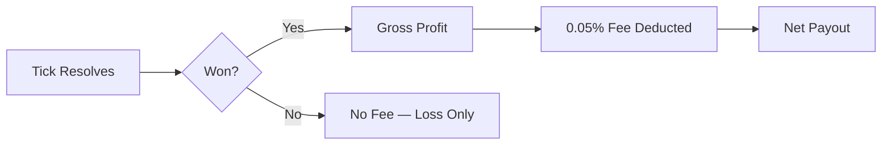

0.05% on profits only. Losers pay nothing. This is the closest thing to justice a financial protocol can offer. The tax falls only on those who have something to be taxed. The rest are left alone with their losses, which is kindness of a sort. Five basis points -- barely a touch, the smallest tax mathematics permits before disappearing entirely.

## Fee Summary

| What | Amount |
|------|--------|
| Fee rate | **0.05%** on profits only |
| Losers pay | **Nothing** |
| Min stake | 0.1 USDC per tick |

**Example:** You win 20 USDC → fee is 0.01 USDC → you receive 19.99 USDC.



## Fee Constants

```solidity
uint256 public constant PROTOCOL_FEE_BPS = 5;       // 0.05% in basis points
uint256 public constant BPS_DENOMINATOR = 10000;     // Basis point denominator
```

| Parameter | Value |
|-----------|-------|
| Fee rate | 0.05% (5 basis points) |
| Denominator | 10,000 |
| Applied to | Profits only (winnings above your deposit) |
| Losers pay | Nothing |

## Fee Formula

When a player claims rewards and their new balance exceeds their old balance, the protocol takes its share. The arithmetic is clean. Five basis points, applied to profits, never to principal:

```
winnings = newBalance - oldBalance
fee = (winnings * 5) / 10000
payout = winnings - fee
```

### Worked Example

A player has a current balance of 100 USDC and wins 20 USDC across several ticks. Here is what the protocol keeps and what the player receives -- the small toll exacted on fortune:

```
oldBalance = 100,000,000  (100 USDC, 6 decimals)
newBalance = 120,000,000  (120 USDC)

winnings   = 120,000,000 - 100,000,000 = 20,000,000  (20 USDC)
fee        = (20,000,000 * 5) / 10,000 = 10,000       (0.01 USDC)
payout     = 20,000,000 - 10,000 = 19,990,000          (19.99 USDC)
```

The player receives **19.99 USDC** in profit. The protocol accumulates **0.01 USDC** in fees.

<Info>
Fees are calculated in USDC with 6 decimal places. The integer division means sub-cent amounts are truncated (rounded down), slightly favoring the player. Even the rounding errors are merciful.
</Info>

## When Fees Apply

Fees appear at two moments: when you claim your winnings, and when you leave. Both are moments of accounting -- the protocol tallies what you earned and takes its fraction. Only its fraction. Never more.

### On Claim

When a player calls `claimRewards`, the fee is computed on the difference between the old and new balance:

```solidity
if (newBalance > oldBalance) {
    uint256 winnings = newBalance - oldBalance;
    uint256 fee = (winnings * PROTOCOL_FEE_BPS) / BPS_DENOMINATOR;
    accumulatedFees += fee;
    uint256 payout = winnings - fee;
    USDC.safeTransfer(msg.sender, payout);
}
```

If `newBalance <= oldBalance`, the player lost money over the claim period. No fee is charged, and no USDC is transferred.

### On Withdrawal

When a player calls `withdraw` to exit a batch, the fee is computed on **total profit** over the lifetime of the position:

```solidity
uint256 totalDeposited = position.totalDeposited;
uint256 profit = finalBalance > totalDeposited ? finalBalance - totalDeposited : 0;
uint256 fee = (profit * PROTOCOL_FEE_BPS) / BPS_DENOMINATOR;
uint256 payout = finalBalance - fee;
```

This means the fee on withdrawal considers the entire history, not just the latest claim window.

### Withdrawal Example

A player deposited 500 USDC total over time. Their final balance is 650 USDC:

```
totalDeposited = 500,000,000  (500 USDC)
finalBalance   = 650,000,000  (650 USDC)

profit  = 650,000,000 - 500,000,000 = 150,000,000  (150 USDC)
fee     = (150,000,000 * 5) / 10,000 = 75,000        (0.075 USDC)
payout  = 650,000,000 - 75,000 = 649,925,000          (649.925 USDC)
```

## Losers Pay Nothing

If a player's balance decreases over a tick (or over their entire position lifetime), **no fee is charged**. The fee only applies to positive winnings. Loss is its own punishment. The protocol does not add to it.

- If you deposit 100 USDC and your balance drops to 80 USDC, you withdraw 80 USDC with no fee.
- If you deposit 100 USDC, it goes to 50 USDC, then recovers to 110 USDC, you only pay fees on the 10 USDC profit when you claim or withdraw.

<Tip>
Fees are never applied to your deposited principal, only to gains above it. The protocol only charges for the privilege of being right. Being wrong is free.
</Tip>

## Minimum Stake

To join a batch, the player's `stakePerTick` must be at least `MIN_STAKE_PER_TICK`. Ten cents. The price of admission to a prediction market. The price of having an opinion and backing it with something other than words:

```solidity
uint256 public constant MIN_STAKE_PER_TICK = 1e5; // 0.1 USDC (6 decimals)
```

| Parameter | Value |
|-----------|-------|
| Minimum stake per tick | 100,000 (0.1 USDC) |
| USDC decimals | 6 |
| Minimum deposit | Must be >= stakePerTick |

This minimum prevents dust attacks and ensures each player has a meaningful stake in the game.

<Warning>
If `stakePerTick` is less than `MIN_STAKE_PER_TICK`, the `joinBatch` call reverts with `StakeBelowMinimum`. If the initial deposit is less than `stakePerTick`, it reverts with `InsufficientDeposit`.
</Warning>

## Fee Collection

Accumulated fees are held in the Vision contract until the designated `feeCollector` address calls `collectFees`. The fees sit there, accruing, waiting -- the protocol's quiet tax on the perpetual optimism of its participants:

```solidity
function collectFees() external {
    if (msg.sender != feeCollector) revert Unauthorized();

    uint256 fees = accumulatedFees;
    accumulatedFees = 0;

    USDC.safeTransfer(feeCollector, fees);
}
```

- Only the `feeCollector` (set at contract deployment) can withdraw accumulated fees.
- Fees are transferred as a lump sum, resetting the `accumulatedFees` counter to zero.

## Solvency Check

Every claim and withdrawal includes a solvency check to ensure the contract can cover the payout plus any accumulated fees:

```solidity
if (USDC.balanceOf(address(this)) < payout + accumulatedFees) revert InsolventPayout();
```

This prevents a scenario where payouts exceed the contract's actual USDC holdings. The contract will not promise what it cannot deliver. In this it is more honest than most institutions.
