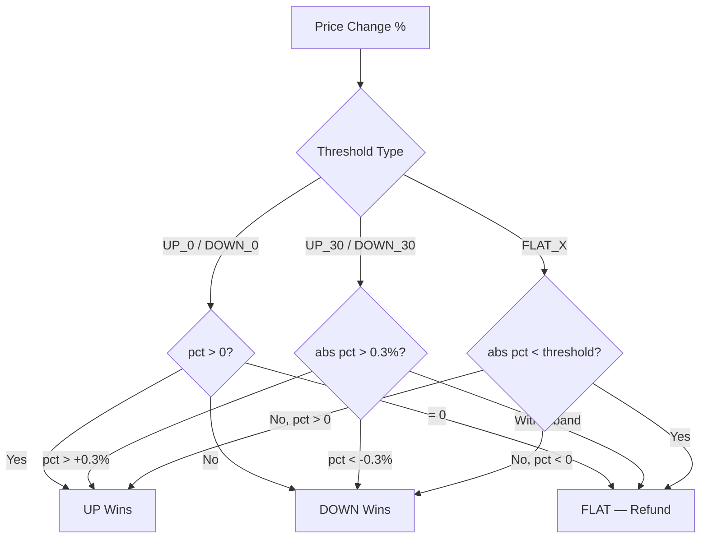

How much must a price move to count as movement? This page answers that question. The market answers a different one -- whether anyone was right about the direction. The resolution type is the threshold between noise and signal, between a refund and a reckoning.

A **resolution type** defines the win condition for a market within a batch. Each market in a batch has its own resolution type, stored as a `uint8` in the `resolutionTypes` array. The resolution type determines how much the price must move for a market to resolve as UP, DOWN, or FLAT.

## Resolution Type Table

### Standard Types (0-7)

| Value | Name | Threshold | UP Wins When | DOWN Wins When | FLAT When |
|-------|------|-----------|-------------|---------------|-----------|
| 0 | `UP_0` | 0% | price > 0% | price < 0% | price = 0% |
| 1 | `UP_30` | 0.30% | price > +0.30% | price < -0.30% | -0.30% to +0.30% |
| 2 | `UP_X` | Custom | price > +X% | price < -X% | -X% to +X% |
| 3 | `DOWN_0` | 0% | price > 0% | price < 0% | price = 0% |
| 4 | `DOWN_30` | 0.30% | price > +0.30% | price < -0.30% | -0.30% to +0.30% |
| 5 | `DOWN_X` | Custom | price > +X% | price < -X% | -X% to +X% |
| 6 | `FLAT_0` | 0.01% | price > +0.01% | price < -0.01% | abs(price) < 0.01% |
| 7 | `FLAT_X` | Custom | price > +X% | price < -X% | abs(price) < X% |

### Extended Types (8-13)

| Value | Name | Threshold | UP Wins When | DOWN Wins When | FLAT When |
|-------|------|-----------|-------------|---------------|-----------|
| 8 | `UP_300` | 3% | price > +3% | price <= +3% | — |
| 9 | `UP_3000` | 30% | price > +30% | price <= +30% | — |
| 10 | `DOWN_300` | 3% | price >= -3% | price < -3% | — |
| 11 | `DOWN_3000` | 30% | price >= -30% | price < -30% | — |
| 12 | `FLAT_300` | 3% | price > +3% | price < -3% | abs(price) < 3% |
| 13 | `FLAT_3000` | 30% | price > +30% | price < -30% | abs(price) < 30% |

<Info>
Extended types (8-13) are hardcoded thresholds — they don't use the `customThresholds` array. They exist as convenience presets for common volatility bands.
</Info>

<Info>
`UP_0` and `DOWN_0` produce identical results. They are separate enum values for semantic clarity -- `UP_0` is named to suggest "will it go up?" while `DOWN_0` suggests "will it go down?". The resolution logic is the same.
</Info>

## Resolution Decision Flow



## Storage

Resolution types are stored as raw `uint8` values on-chain. The Solidity enum defines the first 8 types; extended types (8-13) are handled by the oracle resolver:

```solidity
// IVision.sol — first 8 types
enum ResolutionType {
    UP_0, UP_30, UP_X, DOWN_0, DOWN_30, DOWN_X, FLAT_0, FLAT_X
}
// Types 8-13 (UP_300, UP_3000, DOWN_300, DOWN_3000, FLAT_300, FLAT_3000)
// are stored as uint8 and resolved by the oracle
```

## How Resolution Works

At tick resolution, the oracle computes the percentage change for each market. The arithmetic is simple. The consequences are not:

```
pct_change = (end_price - start_price) / start_price * 100
```

Then applies the resolution type's threshold to determine the outcome:

```rust
match resolution_type {
    UP_0     => if pct > 0   { Up } else if pct < 0   { Down } else { Flat },
    UP_30    => if pct > 30  { Up } else { Down },
    UP_X     => if pct > X   { Up } else { Down },
    DOWN_0   => if pct < 0   { Down } else if pct > 0  { Up } else { Flat },
    DOWN_30  => if pct < -30 { Down } else { Up },
    DOWN_X   => if pct < -X  { Down } else { Up },
    FLAT_0   => if pct.abs() < 1    { Flat } else if pct > 0 { Up } else { Down },
    FLAT_X   => if pct.abs() < X    { Flat } else if pct > 0 { Up } else { Down },
    UP_300   => if pct > 300  { Up } else { Down },
    UP_3000  => if pct > 3000 { Up } else { Down },
    DOWN_300 => if pct < -300  { Down } else { Up },
    DOWN_3000=> if pct < -3000 { Down } else { Up },
    FLAT_300 => if pct.abs() < 300  { Flat } else if pct > 0 { Up } else { Down },
    FLAT_3000=> if pct.abs() < 3000 { Flat } else if pct > 0 { Up } else { Down },
}
// Note: pct is in basis points (1 bps = 0.01%)
```

## Custom Thresholds

Resolution types ending in `_X` (`UP_X`, `DOWN_X`, `FLAT_X`) use custom thresholds -- you define what counts as movement. This is a power that should be exercised with care, because the threshold you choose determines who wins, who loses, and how often everyone gets refunded. These are passed in the `customThresholds` array when creating a batch, stored as **basis points** (1/100th of a percent).

| Basis Points | Percentage |
|-------------|------------|
| 10 | 0.10% |
| 30 | 0.30% |
| 50 | 0.50% |
| 100 | 1.00% |
| 500 | 5.00% |

The threshold is applied symmetrically: a threshold of 100 basis points (1%) means the price must move more than +1% for UP or more than -1% for DOWN.

**Example:** Create a batch where BTC needs to move more than 1% and ETH needs to move more than 0.5%:

```javascript
const marketIds = [
  keccak256(toUtf8Bytes("BTC-USD")),
  keccak256(toUtf8Bytes("ETH-USD")),
];

const resolutionTypes = [2, 2]; // UP_X for both
const tickDuration = 3600;      // 1 hour
const customThresholds = [
  100,  // BTC: 1.00% threshold (100 basis points)
  50,   // ETH: 0.50% threshold (50 basis points)
];

await vision.createBatch(marketIds, resolutionTypes, tickDuration, customThresholds);
```

<Warning>
The `customThresholds` array must be parallel to `marketIds`. Each entry corresponds to the market at the same index. For non-custom resolution types (like `UP_0` or `UP_30`), the threshold value is ignored but a placeholder (e.g., `0`) should still be provided to maintain array alignment.
</Warning>

## Examples with Real Price Movements

Theory is comfortable. Numbers make it real. Here is what resolution looks like when applied to actual prices -- the moment where abstraction meets consequence:

### Example 1: UP_0 (Any Movement)

BTC-USD moves from $60,000 to $60,050 (+0.083%):

- **Resolution type**: `UP_0` (value 0)
- **Percentage change**: +0.083%
- **Outcome**: **UP** (any positive movement counts)
- Players who predicted UP win; DOWN loses.

### Example 2: UP_30 (0.30% Threshold)

ETH-USD moves from $3,000 to $3,005 (+0.167%):

- **Resolution type**: `UP_30` (value 1)
- **Percentage change**: +0.167%
- **Outcome**: **FLAT** (did not exceed +0.30% or -0.30%)
- All players are refunded.

### Example 3: UP_X with 1% Threshold

SOL-USD moves from $100 to $98.50 (-1.5%):

- **Resolution type**: `UP_X` (value 2), threshold = 100 bps (1%)
- **Percentage change**: -1.5%
- **Outcome**: **DOWN** (exceeded -1% threshold)
- Players who predicted DOWN win; UP loses.

### Example 4: FLAT_0 (Near Zero)

AVAX-USD moves from $25.00 to $25.002 (+0.008%):

- **Resolution type**: `FLAT_0` (value 6)
- **Percentage change**: +0.008%
- **Outcome**: **FLAT** (absolute change < 0.01%)
- All players are refunded.

### Example 5: FLAT_X with 0.5% Threshold

BTC-USD moves from $60,000 to $60,200 (+0.333%):

- **Resolution type**: `FLAT_X` (value 7), threshold = 50 bps (0.5%)
- **Percentage change**: +0.333%
- **Outcome**: **FLAT** (absolute change < 0.5%)
- All players are refunded.

## Choosing a Resolution Type

The choice of resolution type is the choice of what counts. A high threshold means most ticks end in a refund -- the price moved, but not enough. A low threshold means every tremor is a verdict. Neither is correct. Both are honest.

<Tip>
Higher thresholds mean more FLAT outcomes and fewer winning/losing rounds. Choose based on the expected volatility of your markets and the tick duration:

- **Short ticks (1-10 min)**: Use `UP_0` or `DOWN_0` for maximum action. Small price movements still produce winners.
- **Medium ticks (1 hour)**: Use `UP_30` or `DOWN_30` to filter out noise. Only meaningful moves count.
- **Long ticks (1 day+)**: Use custom thresholds (`UP_X`) to require substantial moves, since daily volatility is higher.
- **Flat markets**: Use `FLAT_0` or `FLAT_X` when you want the game to reward those who predict that nothing will happen -- which is, more often than not, the correct prediction.
</Tip>
