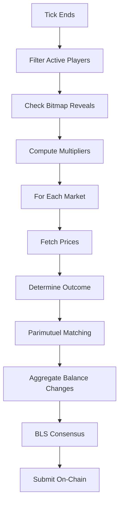

Every ten minutes, the world is measured. Prices move or they do not. Winners are paid with losers' money. The protocol takes 0.05%. Time continues.

## What Happens Every Tick

Every tick, the system resolves all markets in a batch. It is a small reckoning, repeated endlessly:

1. Fetch start/end prices for each market
2. Determine outcome (UP / DOWN / FLAT)
3. Match winners against losers (parimutuel)
4. Update player balances
5. BLS-sign results across oracles

Check your balance after resolution: `GET /vision/balance/{batchId}/{playerAddress}`

## What Is a Tick?

A tick is a discrete time window -- a unit of waiting. The batch's `tickDuration` defines how long each window lasts. Tick numbering starts from `createdAtTick` (the tick number when the batch was created). Time is sliced into intervals, and in each interval, reality delivers its verdict.

```
Tick N starts at: (createdAtTick + N) * tickDuration
Tick N ends at:   (createdAtTick + N + 1) * tickDuration
```

For a batch created at tick 1000 with `tickDuration = 600` (10 minutes):

| Tick | Starts At | Ends At |
|------|-----------|---------|
| 0 | 600,000 | 600,600 |
| 1 | 600,600 | 601,200 |
| 2 | 601,200 | 601,800 |

<Info>
Tick numbers are computed from Unix timestamps: `currentTick = block.timestamp / tickDuration`. The `createdAtTick` anchors the batch's tick numbering to the blockchain's time.
</Info>

## Resolution Cycle

When a tick becomes due for resolution, the oracle engine runs its pipeline. It is mechanical, deterministic, and utterly fair -- which is to say, it has no mercy:



### Step by Step

**1. Check due batches.** The tick scheduler polls at regular intervals (default: 1 second) and identifies batches whose current tick has ended plus the reveal window has elapsed.

**2. Filter active players.** Only players with a non-zero balance participate. Zero-balance players are skipped.

**3. Check bitmap reveals.** Each active player's bitmap must have been revealed to the oracle (submitted via `POST /vision/bitmap`). Players who did not reveal are **voided** -- their balance stays unchanged and they do not participate in side matching.

**4. Compute multipliers.** Each revealed player gets an early multiplier and a commitment multiplier applied to their stake. See [Multipliers](#multipliers) below.

**5. Resolve each market.** For every market in the batch:
   - Fetch the start price (from the previous tick's end price) and end price (current snapshot).
   - Check that price data is not stale (older than the configured threshold, default 300 seconds).
   - Compute the percentage change: `(end - start) / start * 100`.
   - Determine the outcome using the market's resolution type. See [Resolution Types](/vision/concepts/resolution-types).
   - Decode each player's bitmap bit for this market index (1 = UP, 0 = DOWN).
   - Run parimutuel side matching to compute payouts.

**6. Aggregate balance changes.** Sum each player's deltas across all markets to produce a single net balance change per player.

**7-8. BLS consensus and on-chain submission.** Oracles sign the results with BLS keys and submit on-chain for claiming.

## Market Outcomes

Each market in a tick resolves to one of six outcomes. Most are self-explanatory. All are final:

| Outcome | Meaning | Effect |
|---------|---------|--------|
| **Up** | Price increased (meeting the resolution type's threshold) | UP side wins, DOWN side loses |
| **Down** | Price decreased (meeting the threshold) | DOWN side wins, UP side loses |
| **Flat** | Price change did not meet any threshold | Full refund to all players |
| **Cancelled** | Price data missing or stale | Full refund to all players |
| **AllSameSide** | All players picked the same side (no opponents) | Full refund to all players |
| **AllLosers** | Nobody picked the winning side | Full refund to all players |

### Parimutuel Side Matching

For markets with a clear winner (Up or Down), the parimutuel matching algorithm distributes the pot. The word "parimutuel" comes from the French -- *pari mutuel*, mutual betting. Everyone stakes against everyone. The house merely facilitates the redistribution of confidence:

1. Split players into UP and DOWN sides based on their bitmap bits.
2. Compute total effective stake for each side.
3. **Matched amount** = min(UP total, DOWN total). The smaller side is fully matched; the larger side has excess refunded.
4. **Winners** receive their matched stake back plus a proportional share of the losers' matched pool.
5. **Losers** forfeit their matched stake; unmatched excess is refunded.

```
Example: UP side = 300 USDC, DOWN side = 100 USDC, outcome = UP

Matched = min(300, 100) = 100 USDC

UP player (300 stake):
  matched_stake = 300 * 100 / 300 = 100
  refund = 300 - 100 = 200
  payout = 100 * 2 = 200
  Total received: 200 + 200 = 400 (profit = 100)

DOWN player (100 stake):
  matched_stake = 100 * 100 / 100 = 100
  refund = 0
  payout = 0
  Total received: 0 (loss = 100)
```

<Info>
The total payout across all players always equals the total effective stakes. No USDC is created or destroyed during matching -- it is purely redistributed between winners and losers. Money does not appear or vanish. It merely changes hands, as it has always done.
</Info>

### AllSameSide

If every player in a market picks the same side, there are no opponents to match against. All stakes are returned as a full refund. Unanimity, it turns out, is unprofitable. A market needs disagreement to function. Without dissent, there is no game -- only a crowd pointing in the same direction, which is not a market but a procession.

### AllLosers

If a resolution type with a threshold (e.g., UP_30) produces a result where neither threshold is met in either direction, the outcome is `Flat` and everyone is refunded. The `AllLosers` outcome is a separate edge case handled in the matching algorithm for robustness.

## Multipliers

Vision rewards the early and the persistent. Those who commit before the tick opens, and those who stay through many ticks, receive amplified stakes. Loyalty and punctuality -- the only virtues a protocol can measure:

### Early Multiplier

Rewards those who commit before the tick opens. The earlier you arrive, the more your stake is amplified. Conviction rewarded, hesitation penalized:

```
early_mult = 1 + min(time_before_tick, tick_duration)^2 / tick_duration^2
```

| When You Join | Early Multiplier |
|--------------|-----------------|
| At tick start | 1.0x |
| Half a tick before | 1.25x |
| One full tick before | 2.0x |
| Two or more ticks before | 2.0x (capped) |

### Commitment Multiplier

Rewards those who stay. The logarithmic curve means that persistence is rewarded but never extravagantly -- a slow, asymptotic acknowledgment that you are still here:

```
commitment_mult = log10(ticks_committed + offset)
```

With the default offset of 9:

| Ticks Committed | Commitment Multiplier |
|----------------|----------------------|
| 1 | log10(10) = 1.0x |
| 11 | log10(20) = 1.3x |
| 91 | log10(100) = 2.0x |
| 991 | log10(1000) = 3.0x |

### Effective Stake

```
effective_stake = stake_per_tick * early_mult * commitment_mult
```

The effective stake is capped at the player's current balance. A player cannot risk more than they have deposited. The protocol, unlike life, will not let you lose what you do not have.

## Commitment Offset

The default **commitment offset** is 9. This parameter shifts the commitment multiplier's log curve so that the first tick starts at exactly 1.0x (since `log10(1 + 9) = log10(10) = 1.0`). Without the offset, a single tick would produce `log10(1) = 0`, which would zero out the effective stake.

## Reveal Window

After a tick ends, there is a pause. Ten minutes of grace. Oracles wait for the **reveal window** (default: 600 seconds) before resolving. This gives players time to submit their bitmap reveals to oracles.

```
Tick ends at: T
Reveal deadline: T + 600 seconds
Resolution happens after: T + 600 seconds
```

<Warning>
If a player does not reveal their bitmap before the reveal window closes, they are voided for that tick. Their balance is unchanged, but they miss out on potential winnings. The protocol does not wait.
</Warning>

After the reveal window expires, bitmaps become public and can be queried via the API:

```
GET /vision/reveal/{batch_id}/{tick_id}
```

This only returns data after the reveal deadline has passed. Before that, the endpoint returns `403 Forbidden`. Some things are not yet ready to be known.
